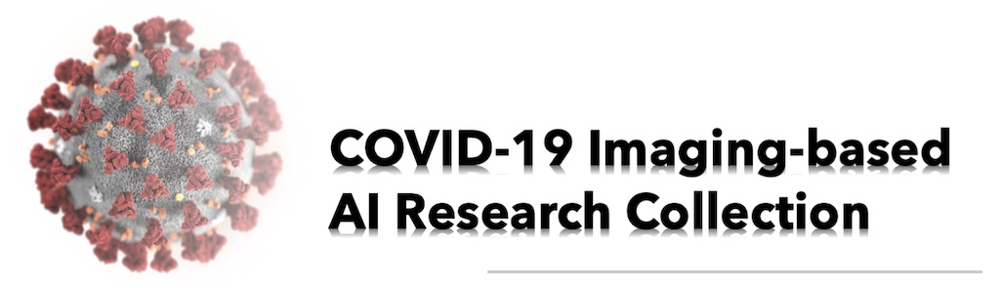

# COVID-19 Imaging-based AI Research Collection

This is a collection of COVID-19 imaging-based AI research papers and datasets. If you have paper to recommend or any suggestions, please feel free to contact us. 
 
Contributed by  [*Huazhu Fu*](https://hzfu.github.io), [*Deng-Ping Fan*](https://dpfan.net/), [*Geng Chen*](https://www.researchgate.net/profile/Geng_Chen13), and [*Tao Zhou*](https://taozh2017.github.io).

--- *Last updated: 2020/08/06* --- 

*Caution: We list the peer-reviewed papers before the preprints (e.g., arXiv and medRxiv).   
Preprints are preliminary reports of work that have not been certified by peer review. They should not be relied on to guide clinical practice or health-related behavior and should not be reported in news media as established information.*

------

## Content:

1. <a href="#survey"> Survey and comments </a>
2. <a href="#dataset"> Datasets </a>
3. <a href="#clinical"> Imaging-based Clinical Papers </a>
4. <a href="#technical"> AI-related Technical Papers </a>
    1. <a href="#technical_CT"> CT-based methods: </a>
    1. <a href="#technical_CXR"> CXR-based methods: </a>
    1. <a href="#technical_other"> Other imaging methods: </a>
5. See COVID-19 papers from: 
    1. [arXiv](https://arxiv.org/covid19search)
    1. [medRxiv and bioRxiv](https://connect.biorxiv.org/relate/content/181)
    1. [RSNA](https://www.rsna.org/covid-19)
    1. [JAMA](https://jamanetwork.com/journals/jama/pages/coronavirus-alert)
    1. [NEJM](https://www.nejm.org/coronavirus)
    1. [Science](https://www.sciencemag.org/collections/coronavirus)
    1. [PNAS](https://www.pnas.org/covid-19)
    1. [The Lancet](https://www.thelancet.com/coronavirus)
6. COVID-19 Special Issue CFP: 
    1. **IEEE Transactions on Medical Imaging:**  
    [Special Issue on "Imaging-based Diagnosis of COVID-19"](http://uat.embs.org/wp-content/uploads/2020/03/Special_Issue_CFP_COVID-19.pdf)
    1. **IEEE Journal of Biomedical and Health Informatics:**  
    [Special Issue on "AI-driven Informatics, Sensing, Imaging and Big Data Analytics for Fighting the COVID-19 Pandemic"](https://www.embs.org/ai-driven-informatics-sensing-imaging-and-big-data-analytics-for-fighting-the-covid-19-pandemic/)
    1. **Medical Image Analysis:**  
    [Special Issue on "Intelligent Analysis of COVID-19 Imaging Data"](https://www.journals.elsevier.com/medical-image-analysis/call-for-papers/special-issue-on-intelligent-analysis-of-covid-19-imaging-da)
    1. **Pattern Recognition:**  
    [Special Issue on "Special Submission Stream on AI for Combating COVID-2019"](https://www.journals.elsevier.com/pattern-recognition/call-for-papers/special-submission-stream-on-ai-for-combating-covid-2019) 
7. COVID-19 World Dashboard:
    1. From: [World Health Organization (WHO)](https://covid19.who.int)
    1. From: [Johns Hopkins University (JHU)](https://coronavirus.jhu.edu/map.html)

------

## Survey and comments:  <a id="survey" class="anchor" href="#survey" aria-hidden="true"></a>  

1. **"Review of Artificial Intelligence Techniques in Imaging Data Acquisition, Segmentation and Diagnosis for COVID-19."** IEEE Reviews in Biomedical Engineering, 2020.  
doi: https://doi.org/10.1109/RBME.2020.2987975

    *Feng Shi, Jun Wang, Jun Shi, Ziyan Wu, Qian Wang, Zhenyu Tang, Kelei He, Yinghuan Shi, Dinggang Shen*

1. **"The role of imaging in the detection and management of COVID-19: a review."** IEEE Reviews in Biomedical Engineering, 2020.  
doi: https://doi.org/10.1109/RBME.2020.2990959

    *Di Dong, Zhenchao Tang, Shuo Wang, Hui Hui, Lixin Gong, Yao Lu, Zhong Xue, Hongen Liao, Fang Chen, Fan Yang, Ronghua Jin, Kun Wang, Zhenyu Liu, Jingwei Wei, Wei Mu, Hui Zhang, Jingying Jiang, Jie Tian, Hongjun Li*

1. **"Digital technology and COVID-19."**  Nature Medicine, 2020.  
doi: https://doi.org/10.1038/s41591-020-0824-5

    *Daniel Shu Wei Ting, Lawrence Carin, Victor Dzau, and Tien Y. Wong*

1. **"A British Society of Thoracic Imaging statement: considerations in designing local imaging diagnostic algorithms for the COVID-19 pandemic."** Clinical Radiology, Volume 75, Issue 5, May 2020, Pages 329-334  
doi: https://doi.org/10.1016/j.crad.2020.03.008

    *A. Nair, J.C.L. Rodrigues, S. Hare, A. Edey, A. Devaraj, J. Jacob, A. Johnstone, R. McStay, Erika Denton, G. Robinson*

1. **"Systematic review and critical appraisal of prediction models for diagnosis and prognosis of COVID-19 infection."** BMJ 2020; 369: m1328, 2020.  
medRxiv: https://doi.org/10.1101/2020.03.24.20041020  
doi: https://doi.org/10.1136/bmj.m1328

    *Laure Wynants, Ben Van Calster, Marc MJ Bonten, Gary S Collins, Thomas PA Debray, Maarten De Vos, Maria C Haller, Georg Heinze, Karel GM Moons, Richard D Riley, Ewoud Schuit, Luc Smits, Kym IE Snell, Ewout W Steyerberg, Christine Wallisch,  Maarten van Smeden*

1. **"A review of mathematical modeling, artificial intelligence and datasets used in the study, prediction and management of COVID-19."** Applied Intelligence, 2020.  
doi: https://doi.org/10.1007/s10489-020-01770-9

    *Youssoufa Mohamadou, Aminou Halidoum, Pascalin Tiam Kapen*

1. **"Detection of Covid-19 From Chest X-ray Images Using Artificial Intelligence: An Early Review."** arXiv, 2020.  
arXiv: https://arxiv.org/abs/2004.05436

    *Muhammad Ilyas, Hina Rehman, Amine Nait-ali*

1. **"Curbing the AI-induced enthusiasm in diagnosing COVID-19 on chest X-Rays: the present and the near-future."** medRxiv 2020.04.28.20082776, 2020.  
doi: https://doi.org/10.1101/2020.04.28.20082776

    *Alexandru Burlacu, Radu Crisan-Dabija, Iolanda Valentina Popa, Bogdan Artene, Vasile Birzu, Mihai Pricop, Cristina Plesoianu, Daniele Generali*

1. **"Computer Vision For COVID-19 Control: A Survey."** arXiv, 2020.   
arXiv: https://arxiv.org/abs/2004.09420 

    *Anwaar Ulhaq Asim Khan Douglas Gomes Manoranjan Paul*

1. **"Artificial Intelligence against COVID-19: An Early Review."** IZA Discussion Papers 13110, Institute of Labor Economics (IZA), 2020.  
Link: http://ftp.iza.org/dp13110.pdf

    *Wim Naudé.*
 
1. **Mapping the landscape of artificial intelligence applications against COVID-19.** arXiv, 2020.  
arXiv: https://arxiv.org/abs/2003.11336  

    *Joseph Bullock, Alexandra (Sasha)Luccioni, Katherine Hoffmann Pham, Cynthia Sin Nga Lam, Miguel Luengo-Oroz*

1. **"Zero-Shot Learning and its Applications from Autonomous Vehicles to COVID-19 Diagnosis: A Review."** arXiv, 2020.  
arXiv: https://arxiv.org/abs/2004.14143

    *Mahdi Rezaei, Mahsa Shahidi*

1. **"Diagnostic performance of CT and its key signs for COVID-19: A systematic review and meta-analysis."** medRxiv 2020.05.24.20111773, 2020.   
doi: https://doi.org/10.1101/2020.05.24.20111773

    *Kai Li, Xiuting Wu, Yuhui Zhong, Wanyue Qin, Zhenxi Zhang*

1. **"A Review of Automatically Diagnosing COVID-19 based on Scanning Image."** arXiv, 2020.  
doi: https://arxiv.org/abs/2006.05245

    *Delong Chen, Fan Liu, Zewen Li*

1. **"COVID19 Detection from Radiographs: Is Deep Learning Able to Handle the Crisis?"** Preprints 2020, 2020060189.  
Preprints: https://www.preprints.org/manuscript/202006.0189/v1  
Project: https://github.com/saeed-anwar/COVID19-Baselines

    *Muhammad Saqib, Saeed Anwar, Abbas Anwar, Lars Petersson, Nabin Sharma, Michael Blumenstein*

1. **"Comparative study of deep learning methods for the automatic segmentation of lung, lesion and lesion type in CT scans of COVID-19 patients"** arXiv, 2020.  
arXiv: https://arxiv.org/abs/2007.15546

    *Sofie Tilborghs, Ine Dirks, Lucas Fidon, Siri Willems, Tom Eelbode, Jeroen Bertels, Bart Ilsen, Arne Brys, Adriana Dubbeldam, Nico Buls, Panagiotis Gonidakis, Sebastián Amador Sánchez, Annemiek Snoeckx, Paul M. Parizel, Johan de Mey, Dirk Vandermeulen, Tom Vercauteren, David Robben, Dirk Smeets, Frederik Maes, Jef Vandemeulebroucke, Paul Suetens*

------

## Datasets: <a id="dataset" class="anchor" href="#dataset" aria-hidden="true"></a> 

1. **"COVID-19 image data collection."** arXiv, 2020.  
arXiv: https://arxiv.org/abs/2003.11597  
dataset: https://github.com/ieee8023/covid-chestxray-dataset

    *Joseph Paul Cohen, Paul Morrison, and Lan Dao*

1. **"COVID-CT-Dataset: a CT scan dataset about COVID-19."** arXiv, 2020.  
arXiv: https://arxiv.org/abs/2003.13865  
dataset: https://github.com/UCSD-AI4H/COVID-CT

    *Jinyu Zhao, Yichen Zhang, Xuehai He, and Pengtao Xie*

1. **"COVID-19 Patients Lungs X Ray Images 10000."**  
Kaggle: https://www.kaggle.com/nabeelsajid917/covid-19-x-ray-10000-images 

1. **"COVID-19 Radiography Database."**  
Kaggle: https://www.kaggle.com/tawsifurrahman/covid19-radiography-database

1. **"COVID-19 Xray Dataset (Train & Test Sets)."**  
Kaggle: https://www.kaggle.com/khoongweihao/covid19-xray-dataset-train-test-sets

1. **"COVID-19 CT segmentation dataset"**  
Link: https://medicalsegmentation.com/covid19/

1. **"Fighting Covid-19 Challenge - A platform for open research on large Covid-19 imaging datasets"**  
Link: https://www.covid19challenge.eu

1. **"COVID-19: CASISTICA RADIOLOGICA ITALIANA"** 
Link: https://www.sirm.org/category/senza-categoria/covid-19/

1. **"Radiopaedia: COVID-19"** 
Link: https://radiopaedia.org/articles/covid-19-3

1. **"COVID-19 CT Lung and Infection Segmentation Dataset."** [Data set]. Zenodo, 2020.  
doi: http://doi.org/10.5281/zenodo.3757476  
dataset: https://zenodo.org/record/3757476#.XqgOxS-cZXh

    *Jun Ma, Cheng Ge, Yixin Wang, Xingle An, Jiantao Gao, Ziqi Yu, Minqing Zhang, Xin Liu, Xueyuan Deng, Shucheng Cao, Hao Wei, Sen Mei, Xiaoyu Yang, Ziwei Nie, Chen Li, Lu Tian, Yuntao Zhu, Qiongjie Zhu, Guoqiang Dong, Jian He*

1. **"Towards Efficient COVID-19 CT Annotation: A Benchmark for Lung and Infection Segmentation."** arXiv, 2020.  
arXiv: https://arxiv.org/abs/2004.12537  
dataset: https://gitee.com/junma11/COVID-19-CT-Seg-Benchmark

    *Jun Ma, Yixin Wang, Xingle An, Cheng Ge, Ziqi Yu, Jianan Chen, Qiongjie Zhu, Guoqiang Dong, Jian He, Zhiqiang He, Ziwei Nie, Xiaoping Yang*

1. **"POCOVID-Net: Automatic Detection of COVID-19 From a New Lung Ultrasound Imaging Dataset (POCUS)."** arXiv, 2020.  
arXiv: https://arxiv.org/abs/2004.12084  
dataset: https://github.com/jannisborn/covid19_pocus_ultrasound

    *Jannis Born, Gabriel Brändle, Manuel Cossio, Marion Disdier, Julie Goulet, Jérémie Roulin, Nina Wiedemann*

1. **"MosMedData: Chest CT Scans with COVID-19 Related Findings."**  
 web: https://mosmed.ai/en/ 

    *Sergey Morozov, Anna Andreychenko, Ivan Blokhin, Anton Vladzymyrskyy, Pavel Gelezhe, Victor Gombolevskiy, Anna Gonchar, Natalya Ledikhova, Nikolay Pavlov, Valeriya Chernina*
 
1. **"SARS-CoV-2 CT-scan dataset: A large dataset of real patients CT scans for SARS-CoV-2 identification."** medRxiv 2020.04.24.20078584, 2020.   
doi: https://doi.org/10.1101/2020.04.24.20078584   
web: www.kaggle.com/plameneduardo/sarscov2-ctscan-dataset

    *Eduardo Soares, Plamen Angelov, Sarah Biaso, Michele Higa Froes, Daniel Kanda Abe*

1. **"BIMCV COVID-19+: a large annotated dataset of RX and CT images from COVID-19 patients."** arXiv, 2020.  
arXiv: https://arxiv.org/abs/2006.01174  
web: http://bimcv.cipf.es/bimcv-projects/bimcv-covid19/

    *Maria de la Iglesia Vayá, Jose Manuel Saborit, Joaquim Angel Montell, Antonio Pertusa, Aurelia Bustos, Miguel Cazorla, Joaquin Galant, Xavier Barber, Domingo Orozco-Beltrán, Francisco Garcia, Marisa Caparrós, Germán González, Jose María Salinas*

1. **"COVID-19-CT-CXR: a freely accessible and weakly labeled chest X-ray and CT image collection on COVID-19 from biomedical literature."** arXiv, 2020.  
arXiv: https://arxiv.org/abs/2006.06177

    *Yifan Peng, Yu-Xing Tang, Sungwon Lee, Yingying Zhu, Ronald M. Summers, Zhiyong Lu*

1. **"Was there COVID-19 back in 2012? Challenge for AI in Diagnosis with Similar Indications."** arXiv, 2020.  
arXiv: https://arxiv.org/abs/2006.13262

    *Imon Banerjee, Priyanshu Sinha, Saptarshi Purkayastha, Nazanin Mashhaditafreshi, Amara Tariq, Jiwoong Jeong, Hari Trivedi, Judy W. Gichoya*

1. **"Study of Different Deep Learning Approach with Explainable AI for Screening Patients with COVID-19 Symptoms: Using CT Scan and Chest X-ray Image Dataset."** arXiv, 2020.  
arXiv: https://arxiv.org/abs/2007.12525

    *Md Manjurul Ahsan, Kishor Datta Gupta, Mohammad Maminur Islam, Sajib Sen, Md. Lutfar Rahman, Mohammad Shakhawat Hossain*

------

## Imaging-based Clinical Papers: <a id="clinical" class="anchor" href="#clinical" aria-hidden="true"></a> 

1. **"Sensitivity of Chest CT for COVID-19: Comparison to RT-PCR."** Radiology, 2020.  
doi: https://doi.org/10.1148/radiol.2020200432

    *Yicheng Fang, Huangqi Zhang, Jicheng Xie, Minjie Lin, Lingjun Ying, Peipei Pang, and Wenbin Ji*

1. **"Chest CT Features of COVID-19 in Rome, Italy."** Radiology, 2020.  
doi: https://doi.org/10.1148/radiol.2020201237

    *Damiano Caruso, Marta Zerunian, Michela Polici, Francesco Pucciarelli, Tiziano Polidori, Carlotta Rucci, Gisella Guido, Benedetta Bracci, Chiara de Dominicis, and Prof. Andrea Laghi*

1. **"Time Course of Lung Changes On Chest CT During Recovery From 2019 Novel Coronavirus (COVID-19) Pneumonia."** Radiology, 2020.  
doi: https://doi.org/10.1148/radiol.2020200370

    *Feng Pan, Tianhe Ye, Peng Sun, Shan Gui, Bo Liang, Lingli Li, Dandan Zheng, Jiazheng Wang, Richard L. Hesketh, Lian Yang, and Chuansheng Zheng*

1. **"Correlation of Chest CT and RT-PCR Testing in Coronavirus Disease 2019 (COVID-19) in China: A Report of 1014 Cases."** Radiology, 2020.  
doi: https://doi.org/10.1148/radiol.2020200642

    *Tao Ai, Zhenlu Yang, Hongyan Hou, Chenao Zhan, Chong Chen, Wenzhi Lv, Qian Tao, Ziyong Sun, and Liming Xia*
    
1. **"Chest CT manifestations of new coronavirus disease 2019 (COVID-19): a pictorial review."** European Radiology, 2020.  
doi: https://doi.org/10.1007/s00330-020-06801-0

    *Zheng Ye, Yun Zhang, Yi Wang, Zixiang Huang, and Bin Song*

1. **"The role of CT in case ascertainment and management of COVID-19 pneumonia in the UK: insights from high-incidence regions."** The Lancet Respiratory Medicine, 2020.  
doi: https://doi.org/10.1016/S2213-2600(20)30132-6

    *Felix Chua, Darius Armstrong-James, Sujal R Desai, Joseph Barnett, Vasileios Kouranos, Onn Min Kon, Ricardo José, Rama Vancheeswaran, Michael R Loebinger, Joyce Wong, Maria Teresa Cutino-Moguel,   Cliff Morgan, Stephane Ledot, Boris Lams, Wing Ho Yip, Leski Li, Ying Cheong Lee, Adrian Draper, Sze Shyang Kho, Elisabetta Renzoni, Katie Ward, Jimstan Periselneris, Sisa Grubnic, Marc Lipman, Athol U Wells, and Anand Devara*

1. **"CT Imaging Features of 2019 Novel Coronavirus (2019-nCoV)."** Radiology, 2020, 295:1, 202-207.  
doi: https://doi.org/10.1148/radiol.2020200230

    *Michael Chung, Adam Bernheim, Xueyan Mei, Ning Zhang, Mingqian Huang, Xianjun Zeng, Jiufa Cui, Wenjian Xu, Yang Yang, Zahi A. Fayad, Adam Jacobi, Kunwei Li, Shaolin Li, and Hong Shan*

1. **"Imaging Profile of the COVID-19 Infection: Radiologic Findings and Literature Review."** Radiology: Cardiothoracic Imaging, 2020, 2:1  
doi: https://doi.org/10.1148/ryct.2020200034

    *Ming-Yen Ng, Elaine YP Lee, Jin Yang, Fangfang Yang, Xia Li, Hongxia Wang, Macy Mei-sze Lui, Christine Shing-Yen Lo, Barry Leung, Pek-Lan Khong, Christopher Kim-Ming Hui, Kwok-yung Yuen, and Michael David Kuo*

1. **"Serial Quantitative Chest CT Assessment of COVID-19: Deep-Learning Approach."** Radiology: Cardiothoracic Imaging, 2020, 2:2  
doi: https://doi.org/10.1148/ryct.2020200075

    *Lu Huang, Rui Han, Tao Ai, Pengxin Yu, Han Kang, Qian Tao, and Liming Xia*

1. **"Clinical features of patients infected with 2019 novel coronavirus in Wuhan, China."** The Lancet, vol. 395, no. 10223, pp. 497–506, 2020.  
doi: https://doi.org/10.1016/S0140-6736(20)30183-5

    *Chaolin Huang, Yeming Wang, Xingwang Li, Lili Ren, Jianping Zhao, Yi Hu, Li Zhang, Guohui Fan, Jiuyang Xu, Xiaoying Gu, Zhenshun Cheng, Ting Yu, Jiaan Xia, Yuan Wei, Wenjuan Wu, Xuelei Xie, Wen Yin, Hui Li, Min Liu, Yan Xiao, Hong Gao, Li Guo, Jungang Xie, Guangfa Wang, Rongmeng Jiang, Zhancheng Gao, Qi Jin, Jianwei Wang, and Bin Cao*
 

1. **"Frequency and Distribution of Chest Radiographic Findings in COVID-19 Positive Patients."** Radiology, 2020.  
doi: https://doi.org/10.1148/radiol.2020201160

    *Ho Yuen Frank Wong, Hiu Yin Sonia Lam, Ambrose Ho-Tung Fong, Siu Ting Leung, Thomas Wing-Yan Chin, Christine Shing Yen Lo, Macy Mei-Sze Lui, Jonan Chun Yin Lee, Keith Wan-Hang Chiu, Tom Chung, Elaine Yuen Phin Lee, Eric Yuk Fai Wan, Fan Ngai Ivan Hung, Tina Poy Wing Lam, Michael Kuo, and Ming-Yen Ng*

1. **"Differences in Clinical and Imaging Presentation of Pediatric Patients with COVID-19 in Comparison with Adults."** Radiology: Cardiothoracic Imaging, 2020, 2:2   
doi: https://doi.org/10.1148/ryct.2020200117

    *Amei Chen, Junxiang Huang, Yuting Liao, Zaosong Liu, Dandan Chen, Chongzhe Yang, Ruimeng Yang, and Xinhua Wei*

1. **"CT image visual quantitative evaluation and clinical classification of coronavirus disease (COVID-19)."** European Radiology, 2020.  
doi: https://doi.org/10.1007/s00330-020-06817-6

    *Kunwei Li, Yijie Fang, Wenjuan Li, Cunxue Pan, Peixin Qin, Yinghua Zhong, Xueguo Liu, Mingqian Huang, Yuting Liao, and Shaolin Li*

1. **"The Role of Chest Imaging in Patient Management during the COVID-19 Pandemic: A Multinational Consensus Statement from the Fleischner Society."** Radiology, 2020.  
doi: https://doi.org/10.1148/radiol.2020201365

    *Geoffrey D. Rubin, Christopher J. Ryerson, Linda B. Haramati, Nicola Sverzellati, Jeffrey P. Kanne, Suhail Raoof, Neil W. Schluger, Annalisa Volpi, Jae-Joon Yim, Ian B. K. Martin, Deverick J. Anderson, Christina Kong, Talissa Altes, Andrew Bush, Sujal R. Desai, Jonathan Goldin, Jin Mo Goo, Marc Humbert, Yoshikazu Inoue, Hans-Ulrich Kauczor, Fengming Luo, Peter J. Mazzone, Mathias Prokop, Martine Remy-Jardin, Luca Richeldi, Cornelia M. Schaefer-Prokop, Noriyuki Tomiyama, Athol U. Wells, and Ann N. Leung*

1. **"How Might AI and Chest Imaging Help Unravel COVID-19’s Mysteries?"** Radiology: Artificial Intelligence, 2020, 2:3.  
doi: https://doi.org/10.1148/ryai.2020200053

    *Shinjini Kundu, Hesham Elhalawani, Judy W. Gichoya, and Charles E. Kahn, Jr*

1. **"A Systematic Meta-Analysis of CT Features of COVID-19: Lessons from Radiology."** medRxiv 2020.04.04.20052241, 2020.  
doi: https://doi.org/10.1101/2020.04.04.20052241

    *Vasantha Kumar Venugopal, Vidur Mahajan, Sriram Rajan, Vikash Kumar Agarwal, Ruchika Rajan, Salsabeel Syed, Harsh Mahajan*

1. **"A globally available COVID-19 - Template for clinical imaging studies."** medRxiv 2020.04.02.20048793, 2020.  
doi: https://doi.org/10.1101/2020.04.02.20048793

    *Gabriel Alexander Salg, Maria Katharina Ganten, Matthias Baumhauer, Claus Peter Heussel, Jens Kleesiek*

1. **"Explainable-By-Design Approach For Covid-19 Classification Via CT-Scan."** medRxiv 2020.04.24.20078584, 2020.   
doi: https://doi.org/10.1101/2020.04.24.20078584

    *Plamen Angelov, Eduardo Soares*

1. **"Diagnostic power of chest CT for COVID-19: to screen or not to screen."** medRxiv 2020.05.18.20097444, 2020.  
doi: https://doi.org/10.1101/2020.05.18.20097444

    *Kristof Smet, Dieter De Smet, Ingel Demedts, Bernard Bouckaert, Thomas Ryckaert, Emanuel Laridon, Birgit Heremans, Ruben Vandenbulcke, Stefaan Gryspeerdt, Geert Antoine Martens*

------

## AI-related Technical Papers: <a id="technical" class="anchor" href="#technical" aria-hidden="true"></a> 

### CT-based methods: <a id="technical_CT" class="anchor" href="#technical_CT" aria-hidden="true"></a> 

1. **"Artificial Intelligence Distinguishes COVID-19 from Community Acquired Pneumonia on Chest CT."** Radiology, 2020.  
doi: https://doi.org/10.1148/radiol.2020200905

    *Lin Li, Lixin Qin, Zeguo Xu, Youbing Yin, Xin Wang, Bin Kong, Junjie Bai, Yi Lu, Zhenghan Fang, Qi Song, Kunlin Cao, Daliang Liu, Guisheng Wang, Qizhong Xu, Xisheng Fang, Shiqin Zhang, Juan Xia, and Jun Xia*

1. **"Severe COVID-19 Pneumonia: Assessing Inflammation Burden with Volume-rendered Chest CT."** Radiology: Cardiothoracic Imaging, 2020, 2:2   
doi: https://doi.org/10.1148/ryct.2020200044

    *Lei Tang, Xiaoyong Zhang, Yvquan Wang, and Xianchun Zeng*

1. **"Quantitative computed tomography analysis for stratifying the severity of Coronavirus Disease 2019."** Journal of Pharmaceutical Analysis, 2020, 2095-1779   
doi: https://doi.org/10.1016/j.jpha.2020.03.004

    *Cong Shen, Nan Yu, Shubo Cai, Jie Zhou, Jiexin Sheng, Kang Liu, Heping Zhou, Youmin Guo, Gang Niu*

1. **"Clinically Applicable AI System for Accurate Diagnosis, Quantitative Measurements and Prognosis of COVID-19 Pneumonia Using Computed Tomography."** Cell, 2020.  
doi: https://doi.org/10.1016/j.cell.2020.04.045  
dataset: http://ncov-ai.big.ac.cn/download?lang=en

    *Kang Zhang, Xiaohong Liu, Jun Shen, Zhihuan Li, Ye Sang, Xingwang Wu, Yunfei Cha, Wenhua Liang, Chengdi Wang, Ke Wang, Linsen Ye, Ming Gao, Zhongguo Zhou, Liang Li, Jin Wang, Zhizhong Yang, Huimin Cai, Jie Xu, Lei Yang, Wenjia Cai, Wenqin Xu, Shaoxu Wu, Wei Zhang, Shanping Jiang, Lianghong Zheng, Xuan Zhang, Li Wang, Liu Lu,  Jiaming Li, Haiying Wu, Winston Wang, Oulan Li, Charlotte Zhang, Liang Liang, Tao Wu, Ruiyun Deng, Kang Wei, Yong Zhou, Ting Chen, Johnson Yiu-Nam Lau, Manson Fok, Jianxing He, Tianxin Lin, Weimin Li, Guangyu Wang*

1. **"AI Augmentation of Radiologist Performance in Distinguishing COVID-19 from Pneumonia of Other Etiology on Chest CT."** Radiology, 2020.  
doi: https://doi.org/10.1148/radiol.2020201491

    *Harrison X. Bai, Robin Wang, Zeng Xiong, Ben Hsieh, Ken Chang, Kasey Halsey, Thi My Linh Tran, Ji Whae Choi, Dong-Cui Wang, Lin-Bo Shi, Ji Mei, Xiao-Long Jiang, Ian Pan, Qiu-Hua Zeng, Ping-Feng Hu, Yi-Hui Li, Fei-Xian Fu, Raymond Y. Huang, Ronnie Sebro, Qi-Zhi Yu, Michael K. Atalay, and Wei-Hua Liao*

1. **"Application of deep learning technique to manage COVID-19 in routine clinical practice using CT images: Results of 10 convolutional neural networks."** Computers in Biology and Medicine, 2020.  
doi: https://doi.org/10.1016/j.compbiomed.2020.103795

    *Ali Abbasian Ardakani, Alireza Rajabzadeh Kanafi, U. Rajendra Acharya, Nazanin Khadem, Afshin Mohammadi*

1. **"Diagnosis of Coronavirus Disease 2019 (COVID-19) with Structured Latent Multi-View Representation Learning."** IEEE Transactions on Medical Imaging, 2020 
doi: https://doi.org/10.1109/TMI.2020.2992546  
arXiv: https://arxiv.org/abs/2005.03227

    *Hengyuan Kang, Liming Xia, Fuhua Yan, Zhibin Wan, Feng Shi, Huan Yuan, Huiting Jiang, Dijia Wu, He Sui, Changqing Zhang, Dinggang Shen*

1. **"Prior-Attention Residual Learning for More Discriminative COVID-19 Screening in CT Images."**  in IEEE Transactions on Medical Imaging, 2020.   
doi: https://doi.org/10.1109/TMI.2020.2994908

    *Jun Wang, Yiming Bao, Yaofeng Wen, Hongbing Lu, Hu Luo, Yunfei Xiang, Xiaoming Li, Chen Liu, Dahong Qian*

1. **"Inf-Net: Automatic COVID-19 Lung Infection Segmentation from CT Images."** in IEEE Transactions on Medical Imaging, 2020.   
arXiv: https://arxiv.org/abs/2004.14133  
doi: https://doi.org/10.1109/TMI.2020.2996645  
Project: https://github.com/DengPingFan/Inf-Net

    *Deng-Ping Fan, Tao Zhou, Ge-Peng Ji, Yi Zhou, Geng Chen, Huazhu Fu, Jianbing Shen, and Ling Shao*

1. **"Relational Modeling for Robust and Efficient Pulmonary Lobe Segmentation in CT Scans."**  in IEEE Transactions on Medical Imaging, 2020.   
doi: https://doi.org/10.1109/TMI.2020.2995108

    *Weiyi Xie, Colin Jacobs, Jean-Paul Charbonnier, Bram van Ginneken*

1. **"Dual-Sampling Attention Network for Diagnosis of COVID-19 from Community Acquired Pneumonia."** in IEEE Transactions on Medical Imaging, 2020.  
arXiv: https://arxiv.org/abs/2005.02690  
doi: https://doi.org/10.1109/TMI.2020.2995508

    *Xi Ouyang, Jiayu Huo, Liming Xia, Fei Shan, Jun Liu, Zhanhao Mo, Fuhua Yan, Zhongxiang Ding, Qi Yang, Bin Song, Feng Shi, Huan Yuan, Ying Wei, Xiaohuan Cao, Yaozong Gao, Dijia Wu, Qian Wang, Dinggang Shen*

1. **"A Weakly-supervised Framework for COVID-19 Classification and Lesion Localization from Chest CT."** in IEEE Transactions on Medical Imaging, 2020.  
doi: https://doi.org/10.1109/TMI.2020.2995965

    *Xinggang Wang, Xianbo Deng, Qing Fu, Qiang Zhou, Jiapei Feng, Hui Ma, Wenyu Liu, Chuansheng Zheng*

1. **"Accurate Screening of COVID-19 using Attention Based Deep 3D Multiple Instance Learning."** in IEEE Transactions on Medical Imaging, 2020.  
doi: https://doi.org/10.1109/TMI.2020.2996256

    *Zhongyi Han, Benzheng Wei, Yanfei Hong, Tianyang Li, Jinyu Cong, Xue Zhu, Haifeng Wei, Wei Zhang*

1. **"A Noise-robust Framework for Automatic Segmentation of COVID-19 Pneumonia Lesions from CT Images."** in IEEE Transactions on Medical Imaging, 2020.  
doi: https://doi.org/10.1109/TMI.2020.3000314

    *Guotai Wang, Xinglong Liu, Chaoping Li, Zhiyong Xu, Jiugen Ruan, Haifeng Zhu, Tao Meng, Kang Li, Ning Huang, Shaoting Zhang*

1. **"A Rapid, Accurate and Machine-agnostic Segmentation and Quantification Method for CT-based COVID-19 Diagnosis."** in IEEE Transactions on Medical Imaging, 2020.  
doi: https://doi.org/10.1109/TMI.2020.3001810

    *Longxi Zhou, Zhongxiao Li, Juexiao Zhou, Haoyang Li, Yupeng Chen, Yuxin Huang, Dexuan Xie, Lintao Zhao, Ming Fan, Shahrukh Hashmi, Faisal AbdelKareem, Riham Eiada, Xigang Xiao, Lihua Li, Zhaowen Qiu, Xin Gao*

1. **"Artificial intelligence–enabled rapid diagnosis of patients with COVID-19."** in Nature Medicine, 2020.  
doi: https://doi.org/10.1038/s41591-020-0931-3

    *Xueyan Mei, Hao-Chih Lee, Kai-yue Diao, Mingqian Huang, Bin Lin, Chenyu Liu, Zongyu Xie, Yixuan Ma, Philip M. Robson, Michael Chung, Adam Bernheim, Venkatesh Mani, Claudia Calcagno, Kunwei Li, Shaolin Li, Hong Shan, Jian Lv, Tongtong Zhao, Junli Xia, Qihua Long, Sharon Steinberger, Adam Jacobi, Timothy Deyer, Marta Luksza, Fang Liu, Brent P. Little, Zahi A. Fayad, Yang Yang*

1. **"A deep learning algorithm using CT images to screen for Corona Virus Disease (COVID-19)."** medRxiv 2020.02.14.20023028, 2020.  
doi: https://doi.org/10.1101/2020.02.14.20023028

    *Shuai Wang, Bo Kang, Jinlu Ma, Xianjun Zeng, Mingming Xiao, Jia Guo, Mengjiao Cai, Jingyi Yang, Yaodong Li, Xiangfei Meng, Bo Xu*

1. **"Deep Learning System to Screen Coronavirus Disease 2019 Pneumonia."** arXiv, 2020.  
arXiv: https://arxiv.org/abs/2002.09334

    *Xiaowei Xu, Xiangao Jiang, Chunlian Ma, Peng Du, Xukun Li, Shuangzhi Lv, Liang Yu, Yanfei Chen, Junwei Su, Guanjing Lang, Yongtao Li, Hong Zhao, Kaijin Xu, Lingxiang Ruan, Wei Wu*

1. **"Lung Infection Quantification of COVID-19 in CT Images with Deep Learning."** arXiv, 2020.  
arXiv: https://arxiv.org/abs/2003.04655

    *Fei Shan, Yaozong Gao, Jun Wang, Weiya Shi, Nannan Shi, Miaofei Han, Zhong Xue, Dinggang Shen, Yuxin Shi*

1.  **"Rapid AI Development Cycle for the Coronavirus (COVID-19) Pandemic: Initial Results for Automated Detection & Patient Monitoring using Deep Learning CT Image Analysis."** arXiv, 2020.  
arXiv: https://arxiv.org/abs/2003.05037

    *Ophir Gozes, Maayan Frid-Adar, Hayit Greenspan, Patrick D. Browning, Huangqi Zhang, Wenbin Ji, Adam Bernheim, Eliot Siegel*

1. **"Deep Learning-based Detection for COVID-19 from Chest CT using Weak Label."** medRxiv, 2020.  
doi: https://doi.org/10.1101/2020.03.12.20027185

    *Chuansheng Zheng, Xianbo Deng, Qing Fu, Qiang Zhou, Jiapei Feng, Hui Ma, Wenyu Liu, Xinggang Wang*

1. **"AI-assisted CT imaging analysis for COVID-19 screening: Building and deploying a medical AI system in four weeks."** medRxiv 2020.03.19.20039354, 2020.  
doi: https://doi.org/10.1101/2020.03.19.20039354

    *Shuo Jin, Bo Wang, Haibo Xu, Chuan Luo, Lai Wei, Wei Zhao, Xuexue Hou, Wenshuo Ma, Zhengqing Xu, Zhuozhao Zheng, Wenbo Sun, Lan Lan, Wei Zhang, Xiangdong Mu, Chenxi Shi, Zhongxiao Wang, Jihae Lee, Zijian Jin, Minggui Lin, Hongbo Jin, Liang Zhang, Jun Guo, Benqi Zhao, Zhizhong Ren, Shuhao Wang, Zheng You, Jiahong Dong, Xinghuan Wang, Jianming Wang, Wei Xu*

1. **"A Fully Automatic Deep Learning System for COVID-19 Diagnostic and Prognostic Analysis."** medRvix 2020.03.24.20042317, 2020.  
doi: https://doi.org/10.1101/2020.03.24.20042317

    *Shuo Wang, Yunfei Zha, Weimin Li, Qingxia Wu, Xiaohu Li, Meng Niu, Meiyun Wang, Xiaoming Qiu, Hongjun Li, He Yu, Wei Gong, Yan Bai, Li Li, Yongbei Zhu, Liusu Wang, Jie Tian*

1. **"Severity Assessment of Coronavirus Disease 2019 (COVID-19) Using Quantitative Features from Chest CT Images."** arXiv, 2020.  
arXiv: https://arxiv.org/abs/2003.11988

    *Zhenyu Tang, Wei Zhao, Xingzhi Xie, Zheng Zhong, Feng Shi, Jun Liu, Dinggang Shen*

1. **"Quantification of Tomographic Patterns associated with COVID-19 from Chest CT."** arXiv, 2020  
arXiv: https://arxiv.org/abs/2004.01279

    *Shikha Chaganti, Abishek Balachandran, Guillaume Chabin, Stuart Cohen, Thomas Flohr, Bogdan Georgescu, Philippe Grenier, Sasa Grbic, Siqi Liu, François Mellot, Nicolas Murray, Savvas Nicolaou, William Parker, Thomas Re, Pina Sanelli, Alexander W. Sauter, Zhoubing Xu, Youngjin Yoo, Valentin Ziebandt, Dorin Comaniciu*
 
1. **"Machine learning-based CT radiomics model for predicting hospital stay in patients with pneumonia associated with SARS-CoV-2 infection: A multicenter study."** medRxiv 2020.02.29.20029603, 2020.  
doi: https://doi.org/10.1101/2020.02.29.20029603

    *Xiaolong Qi, Zicheng Jiang, QIAN YU, Chuxiao Shao, Hongguang Zhang, Hongmei Yue, Baoyi Ma, Yuancheng Wang, Chuan Liu, Xiangpan Meng, Shan Huang, Jitao Wang, Dan Xu, Junqiang Lei, Guanghang Xie, Huihong Huang, Jie Yang, Jiansong Ji, Hongqiu Pan, Shengqiang Zou, Shenghong Ju*

1. **"Deep learning-based model for detecting 2019 novel coronavirus pneumonia on high-resolution computed tomography: a prospective study."** medRxiv 2020.02.25.20021568, 2020.  
doi: https://doi.org/10.1101/2020.02.25.20021568

    *Jun Chen, Lianlian Wu, Jun Zhang, Liang Zhang, Dexin Gong, Yilin Zhao, Shan Hu, Yonggui Wang, Xiao Hu, Biqing Zheng, Kuo Zhang, Huiling Wu, Zehua Dong, Youming Xu, Yijie Zhu, Xi Chen, Lilei Yu, Honggang Yu*
 
1. **"Deep learning Enables Accurate Diagnosis of Novel Coronavirus (COVID-19) with CT images."** medRxiv 2020.02.23.20026930, 2020.  
doi: https://doi.org/10.1101/2020.02.23.20026930

    *Ying Song,  Shuangjia Zheng, Liang Li, Xiang Zhang, Xiaodong Zhang, Ziwang Huang, Jianwen Chen, Huiying Zhao, Yusheng Jie, Ruixuan Wang, Yutian Chong,  Jun Shen,  Yunfei Zha,  Yuedong Yang*

1. **"Development and Evaluation of an AI System for COVID-19 Diagnosis."** medRxiv 2020.03.20.20039834, 2020.  
doi: https://doi.org/10.1101/2020.03.20.20039834

    *Cheng Jin, Weixiang Chen, Yukun Cao, Zhanwei Xu, Xin Zhang, Lei Deng, Chuansheng Zheng, Jie Zhou, Heshui Shi, Jianjiang Feng*

1. **"Large-Scale Screening of COVID-19 from Community Acquired Pneumonia using Infection Size-Aware Classification."** arXiv, 2020.  
arXiv: https://arxiv.org/abs/2003.09860

    *Feng Shi, Liming Xia, Fei Shan, Dijia Wu, Ying Wei, Huan Yuan, Huiting Jiang, Yaozong Gao, He Sui, Dinggang Shen*

1. **"Coronavirus Detection and Analysis on Chest CT with Deep Learning."** arXiv, 2020.  
arXiv: https://arxiv.org/abs/2004.02640

    *Ophir Gozes, Maayan Frid-Adar, Nimrod Sagie, Huangqi Zhang, Wenbin Ji, Hayit Greenspan*

1. **"Harmony-Search and Otsu based System for Coronavirus Disease (COVID-19) Detection using Lung CT Scan Images."** arXiv, 2020.  
arXiv: https://arxiv.org/abs/2004.03431

    *V. Rajinikanth, Nilanjan Dey, Alex Noel Joseph Raj, Aboul Ella Hassanien, K.C. Santosh, N. Sri Madhava Raja*

1. **"COVID_MTNet: COVID-19 Detection with Multi-Task Deep Learning Approaches."** arXiv, 2020.  
arXiv: https://arxiv.org/abs/2004.03747

    *Md Zahangir Alom, M M Shaifur Rahman, Mst Shamima Nasrin, Tarek M. Taha, Vijayan K. Asari*

1. **"Coronavirus (COVID-19) Classification using Deep Features Fusion and Ranking Technique."** arXiv, 2020.  
arXiv: https://arxiv.org/abs/2004.03698

    *Umut Ozkaya, Saban Ozturk, Mucahid Barstugan*

1. **"Residual Attention U-Net for Automated Multi-Class Segmentation of COVID-19 Chest CT Images."** arXiv, 2020.  
arXiv: https://arxiv.org/abs/2004.05645

    *Xiaocong Chen, Lina Yao, Yu Zhang*

1. **"Weakly Supervised Deep Learning for COVID-19 Infection Detection and Classification from CT Images."** arXiv, 2020.  
arXiv: https://arxiv.org/abs/2004.06689

    *Shaoping Hu, Yuan Gao, Zhangming Niu, Yinghui Jiang, Lao Li, Xianglu Xiao, Minhao Wang, Evandro Fei Fang, Wade Menpes-Smith, Jun Xia, Hui Ye, Guang Yang*

1. **"An automatic COVID-19 CT segmentation based on U-Net with attention mechanism."** arXiv, 2020.  
arXiv: https://arxiv.org/abs/2004.06673

    *Tongxue Zhou, Stéphane Canu, Su Ruan*
 
1. **"Sample-Efficient Deep Learning for COVID-19 Diagnosis Based on CT Scans."** medRxiv, 2020.  
doi: https://doi.org/10.1101/2020.04.13.20063941

    *Xuehai He, Xingyi Yang, Shanghang Zhang, Jinyu Zhao, Yichen Zhang, Eric Xing, Pengtao Xie*

1. **"JCS: An Explainable COVID-19 Diagnosis System by Joint Classification and Segmentation."** arXiv, 2020.  
arXiv: https://arxiv.org/abs/2004.07054

    *Yu-Huan Wu, Shang-Hua Gao, Jie Mei, Jun Xu, Deng-Ping Fan, Chao-Wei Zhao, Ming-Ming Cheng*

1. **"Contextual Two-Stage U-Nets for Robust Pulmonary Lobe Segmentation in CT Scans of COVID-19 and COPD Patients."** arXiv, 2020 
arXiv: https://arxiv.org/abs/2004.07443

    *Weiyi Xie, Colin Jacobs, Jean-Paul Charbonnier, Bram van Ginneken*

1. **"Radiologist-Level COVID-19 Detection Using CT Scans with Detail-Oriented Capsule Networks."** arXiv, 2020 
arXiv: https://arxiv.org/abs/2004.07407

    *Aryan Mobiny, Pietro Antonio Cicalese, Samira Zare, Pengyu Yuan, Mohammadsajad Abavisani, Carol C. Wu, Jitesh Ahuja, Patricia M. de Groot, Hien Van Nguyen*

1. **"Machine Learning Analysis of Chest CT Scan Images as a Complementary Digital Test of Coronavirus (COVID-19) Patients."** medRxiv 2020.04.13.20063479, 2020.  
doi: https://doi.org/10.1101/2020.04.13.20063479

    *Dhurgham Al-karawi, Shakir Al-Zaidi, Nisreen Polus, Sabah Jassim*

1. **"Diagnosis and Prediction Model for COVID19 Patients Response to Treatment based on Convolutional Neural Networks and Whale Optimization Algorithm Using CT Images."** medRxiv 2020.04.16.20063990, 2020.  
doi: https://doi.org/10.1101/2020.04.16.20063990

    *Sally M. ELGhamrawy, Abou Ellah Hassanien*

1. **"MiniSeg: An Extremely Minimum Network for Efficient COVID-19 Segmentation."** arXiv, 2020.  
arXiv: https://arxiv.org/abs/2004.09750

    *Yu Qiu, Yun Liu, Jing Xu*

1. **"Firefly-Algorithm Supported Scheme to Detect COVID-19 Lesion in Lung CT Scan Images using Shannon Entropy and Markov-Random-Field."** arXiv, 2020.  
arXiv: https://arxiv.org/abs/2004.09239

    *Venkatesan Rajinikanth, Seifedine Kadry, Krishnan Palani Thanaraj, Krishnamurthy Kamalanand, Sanghyun Seo*

1. **"Automatic Detection of Coronavirus Disease (COVID-19) in X-ray and CT Images: A Machine Learning-Based Approach."** arXiv, 2020.  
arXiv: https://arxiv.org/abs/2004.10641

    *Sara Hosseinzadeh Kassani, Peyman Hosseinzadeh Kassasni, Michal J. Wesolowski, Kevin A. Schneider, Ralph Deters*

1. **"COVID-19 Chest CT Image Segmentation -- A Deep Convolutional Neural Network Solution."** arXiv, 2020.  
arXiv: https://arxiv.org/abs/2004.10987

    *Qingsen Yan, Bo Wang, Dong Gong, Chuan Luo, Wei Zhao, Jianhu Shen, Qinfeng Shi, Shuo Jin, Liang Zhang, Zheng You*
 
1. **"A Light CNN for detecting COVID-19 from CT scans of the chest."** arXiv, 2020.  
arXiv: https://arxiv.org/abs/2004.12837

    *Matteo Polsinelli, Luigi Cinque, Giuseppe Placidi*

1. **"AI-Driven CT-based quantification, staging and short-term outcome prediction of COVID-19 pneumonia."** arXiv, 2020.  
arXiv: https://arxiv.org/abs/2004.12852

    *Guillaume Chassagnon, Maria Vakalopoulou, Enzo Battistella, Stergios Christodoulidis, Trieu-Nghi Hoang-Thi, Severine Dangeard, Eric Deutsch, Fabrice Andre, Enora Guillo, Nara Halm, Stefany El Hajj, Florian Bompard, Sophie Neveu, Chahinez Hani, Ines Saab, Alienor Campredon, Hasmik Koulakian, Souhail Bennani, Gael Freche, Aurelien Lombard, Laure Fournier, Hippolyte Monnier, Teodor Grand, Jules Gregory, Antoine Khalil, Elyas Mahdjoub, Pierre-Yves Brillet, Stephane Tran Ba, Valerie Bousson, Marie-Pierre Revel, Nikos Paragios*
 
1. **"Automated Diagnosis of COVID-19 Using Deep Learning and Data Augmentation on Chest CT."** medRxiv 2020.04.24.20078998, 2020.  
doi: https://doi.org/10.1101/2020.04.24.20078998

    *Runwen Hu, Guanqi Ruan, Shijun Xiang, Minghui Huang, Qiaoyi Liang, Jingxuan Li*

1. **"ai-corona: Radiologist-Assistant Deep Learning Framework for COVID-19 Diagnosis in Chest CT Scans."** medRxiv 2020.05.04.20082081, 2020.  
doi: https://doi.org/10.1101/2020.05.04.20082081

    *Mehdi Yousefzadeh, Parsa Esfahanian, Seyed Mohammad Sadegh Movahed, Saeid Gorgin, Reza Lashgari, Dara Rahmati, Arda Kiani, Shahram Kahkouee, Seyed Alireza Nadji, Sara Haseli, Meisam Hoseinyazdi, Jafar Roshandel, Negar Bandegani, Abbas Danesh, Mehrdad Bakhshayesh Karam, Atefeh Abedini*

1. **"3D Tomographic Pattern Synthesis for Enhancing the Quantification of COVID-19."** arXiv, 2020.  
arXiv: https://arxiv.org/abs/2005.01903

    *Siqi Liu, Bogdan Georgescu, Zhoubing Xu, Youngjin Yoo, Guillaume Chabin, Shikha Chaganti, Sasa Grbic, Sebastian Piat, Brian Teixeira, Abishek Balachandran, Vishwanath RS, Thomas Re, Dorin Comaniciu*

1. **"Automated Diagnosis of COVID-19 Using Deep Learning and Data Augmentation on Chest CT."** medRxiv 2020.04.24.20078998, 2020.   
doi: https://doi.org/10.1101/2020.04.24.20078998

    *Runwen Hu, Guanqi Ruan, Shijun Xiang, Minghui Huang, Qiaoyi Liang, Jingxuan Li*

1. **"CovidCTNet: An Open-Source Deep Learning Approach to Identify Covid-19 Using CT Image."** arXiv, 2020.  
arXiv: https://arxiv.org/abs/2005.03059

    *Tahereh Javaheri, Morteza Homayounfar, Zohreh Amoozgar, Reza Reiazi, Fatemeh Homayounieh, Engy Abbas, Azadeh Laali, Amir Reza Radmard, Mohammad Hadi Gharib, Seyed Ali Javad Mousavi, Omid Ghaemi, Rosa Babaei, Hadi Karimi Mobin, Mehdi Hosseinzadeh, Rana Jahanban-Esfahlan, Khaled Seidi, Mannudeep K. Kalra, Guanglan Zhang, L.T. Chitkushev, Benjamin Haibe-Kains, Reza Malekzadeh, Reza Rawassizadeh*
 
1. **"Adaptive Feature Selection Guided Deep Forest for COVID-19 Classification with Chest CT."** arXiv, 2020.  
arXiv: https://arxiv.org/abs/2005.03264

    *Liang Sun, Zhanhao Mo, Fuhua Yan, Liming Xia, Fei Shan, Zhongxiang Ding, Wei Shao, Feng Shi, Huan Yuan, Huiting Jiang, Dijia Wu, Ying Wei, Yaozong Gao, Wanchun Gao, He Sui, Daoqiang Zhang, Dinggang Shen*

1. **"Joint Prediction and Time Estimation of COVID-19 Developing Severe Symptoms using Chest CT Scan."** arXiv, 2020.  
arXiv: https://arxiv.org/abs/2005.03405

    *Xiaofeng Zhu, Bin Song, Feng Shi, Yanbo Chen, Rongyao Hu, Jiangzhang Gan, Wenhai Zhang, Man Li, Liye Wang, Yaozong Gao, Fei Shan, Dinggang Shen*

1. **"Artificial intelligence-enabled rapid diagnosis of COVID-19 patients."** medRxiv 2020.04.12.20062661, 2020.  
doi: https://doi.org/10.1101/2020.04.12.20062661

    *Xueyan Mei, Hao-Chih Lee, Kaiyue Diao, Mingqian Huang, Bin Lin, Chenyu Liu, Zongyu Xie, Yixuan Ma, Philip M. Robson, Michael Chung, Adam Bernheim, Venkatesh Mani, Claudia Calcagno, Kunwei Li, Shaolin Li, Hong Shan, Jian Lv, Tongtong Zhao, Junli Xia, Qihua Long, Sharon Steinberger, Adam Jacobi, Timothy Deyer, Marta Luksza, Fang Liu, Brent P. Little, Zahi A. Fayad, Yang Yang*

1. **"Synergistic Learning of Lung Lobe Segmentation and Hierarchical Multi-Instance Classification for Automated Severity Assessment of COVID-19 in CT Images."** arXiv, 2020.  
arXiv: https://arxiv.org/abs/2005.03832

    *Kelei He, Wei Zhao, Xingzhi Xie, Wen Ji, Mingxia Liu, Zhenyu Tang, Feng Shi, Yang Gao, Jun Liu, Junfeng Zhang, Dinggang Shen*

1. **"Hypergraph Learning for Identification of COVID-19 with CT Imaging."** arXiv, 2020.  
arXiv: https://arxiv.org/abs/2005.04043

    *Donglin Di, Feng Shi, Fuhua Yan, Liming Xia, Zhanhao Mo, Zhongxiang Ding, Fei Shan, Shengrui Li, Ying Wei, Ying Shao, Miaofei Han, Yaozong Gao, He Sui, Yue Gao, Dinggang Shen*

1. **"Deep learning models for COVID-19 infected area segmentation in CT images."** medRxiv 2020.05.08.20094664, 2020.  
doi: https://doi.org/10.1101/2020.05.08.20094664

    *Athanasios Voulodimos, Eftychios Protopapadakis, Iason Katsamenis, Anastasios Doulamis, Nikolaos Doulamis*

1. **"Online COVID-19 diagnosis with chest CT images: Lesion-attention deep neural networks."** medRxiv 2020.05.11.20097907, 2020.   
doi: https://doi.org/10.1101/2020.05.11.20097907

    *Bin Liu, Xiaoxue Gao, Mengshuang He, Fengmao Lv, Guosheng Yin*

1. **"A collaborative online AI engine for CT-based COVID-19 diagnosis."** medRxiv 2020.05.10.20096073, 2020.   
doi: https://doi.org/10.1101/2020.05.10.20096073

    *Yongchao Xu, Liya Ma, Yang Fan, Yanyan Chen, Ke Ma, Jiehua Yang, Xian Yang, Yaobing Chen, Chang Shu, Ziwei Fan, Jiefeng Gan, Xinyu Zou, Renhao Huang, Changzheng Zhang, Xiaowu Liu, Dandan Tu, Chuou Xu, Wenqing Zhang, Dehua Yang, Ming-Wei Wang, Xi Wang, Xiaoliang Xie, Hongxiang Leng, Nagaraj Holalkere, Neil J. Halin, Ihab Roushdy Kamel, Jia Wu, Xuehua Peng, Xiang Wang, Jianbo Shao, Pattanasak Mongkolwat, Jianjun Zhang, Daniel L. Rubin, Guoping Wang, Chuangsheng Zheng, Zhen Li, Xiang Bai, Tian Xia*

1. **"Assisting Scalable Diagnosis Automatically via CT Images in the Combat against COVID-19."** medRxiv 2020.05.11.20093732, 2020.   
doi: https://doi.org/10.1101/2020.05.11.20093732

    *Bohan Liu, Pan Liu, Lutao Dai, Yanlin Yang, Peng Xie, Yiqing Tan, Jicheng Du, Wei Shan, Chenghui Zhao, Qin Zhong, Xixiang Lin, Xizhou Guan, Ning Xing, Yuhui Sun, Wenjun Wang, Zhibing Zhang, Xia Fu, Yanqing Fan, Meifang Li, Na Zhang, Lin Li, Yaou Liu, Lin Xu, Jingbo Du, Zhenhua Zhao, Xuelong Hu, Weipeng Fan, Rongpin Wang, Chongchong Wu, Yongkang Nie, Liuquan Cheng, Lin Ma, Zongren Li, Qian Jia, Minchao Liu, Huayuan Guo, Gao Huang, Haipeng Shen, Weimin An, Hao Li, Jianxin Zhou, Kunlun He*

1. **"Interpretable Artificial Intelligence for COVID-19 Diagnosis from Chest CT Reveals Specificity of Ground-Glass Opacities."** medRxiv 2020.05.16.20103408, 2020.  
doi: https://doi.org/10.1101/2020.05.16.20103408

    *Anmol Warman, Pranav Warman, Ayushman Sharma, Puja Parikh, Roshan Warman, Narayan Viswanadhan, Lu Chen, Subhra Mohapatra, Shyam Mohapatra, Guillermo Sapiro*
 
1. **"Deep learning models for COVID-19 infected area segmentation in CT images."** medRxiv 2020.05.08.20094664, 2020.   
doi: https://doi.org/10.1101/2020.05.08.20094664

    *Athanasios Voulodimos, Eftychios Protopapadakis, Iason Katsamenis, Anastasios Doulamis, Nikolaos Doulamis*

1. **"Diagnostic power of chest CT for COVID-19: to screen or not to screen."** medRxiv 2020.05.18.20097444, 2020.  
doi: https://doi.org/10.1101/2020.05.18.20097444

    *Kristof De Smet, Dieter De Smet, Ingel Demedts, Bernard Bouckaert, Thomas Ryckaert, Emanuel Laridon, Birgit Heremans, Ruben Vandenbulcke, Stefaan Gryspeerdt, Geert Antoine Martens*

1. **"Pulmonary Thromboembolic Disease in Patients with COVID-19 Undergoing Computed Tomography Pulmonary Angiography (CTPA): Incidence and Relationship with Pulmonary Parenchymal Abnormalities."** medRxiv 2020.06.01.20118505, 2020.  
doi: https://doi.org/10.1101/2020.06.01.20118505

    *Cheng Fang, Giorgio Garzillo, Bhavna Batohi, James T Teo, Marko Berovic, Paul Sidhu, Hasti Robbie*

1.**"CT-based COVID-19 Triage: Deep Multitask Learning Improves Joint Identification and Severity Quantification."** arXiv, 2020.  
arXiv: https://arxiv.org/abs/2006.01441

    *Mikhail Goncharov, Maxim Pisov, Alexey Shevtsov, Boris Shirokikh, Anvar Kurmukov, Ivan Blokhin, Valeria Chernina, Alexander Solovev, Victor Gombolevskiy, Sergey Morozov, Mikhail Belyaev*

1. **"Automated Quantification of CT Patterns Associated with COVID-19 from Chest CT."** arXiv, 2020.  
arXiv: https://arxiv.org/abs/2006.04998

    *Shikha Chaganti, Abishek Balachandran, Guillaume Chabin, Stuart Cohen, Thomas Flohr, apl. Prof., Bogdan Georgescu, Philippe Grenier, Prof., Sasa Grbic, Siqi Liu, François Mellot, Nicolas Murray, Savvas Nicolaou, William Parker, Thomas Re, Pina Sanelli, Alexander W. Sauter, Zhoubing Xu, Youngjin Yoo, Valentin Ziebandt, Dorin Comaniciu*

1. **"Deep learning to estimate the physical proportion of infected region of lung for COVID-19 pneumonia with CT image set."** arXiv, 2020.  
arXiv: https://arxiv.org/abs/2006.05018

    *Wei Wu, Yu Shi, Xukun Li, Yukun Zhou, Peng Du, Shuangzhi Lv, Tingbo Liang, Jifang Sheng*

1. **"A Fully Automated Deep Learning-based Network For Detecting COVID-19 from a New And Large Lung CT Scan Dataset."** medRxiv 2020.06.08.20121541, 2020.   
doi: https://doi.org/10.1101/2020.06.08.20121541

    *Mohammad Rahimzadeh, Abolfazl Attar, Seyed Mohammad Sakhaei*

1. **"A Comparative Study of Target Reconstruction of Ultra-High-Resolution CT for Patients with Corona-Virus Disease 2019 (COVID-19)."** medRxiv 2020.06.04.20119206, 2020.   
doi: https://doi.org/10.1101/2020.06.04.20119206

    *Shaomao Lv, Yu Lin, Jianghe Kang, Shaoyin Duan, Weiguo Zhang, Jin-an Wang*

1. **"Improving effectiveness of different deep learning-based models for detecting COVID-19 from computed tomography (CT) images."** medRxiv 2020.06.12.20129643, 2020.  
doi: https://doi.org/10.1101/2020.06.12.20129643

    *Erdi Acar, Engin ŞAHİN, İhsan Yilmaz*

1. **"Automated Detection of COVID-19 from CT Scans Using Convolutional Neural Networks."** arXiv, 2020.  
arXiv: https://arxiv.org/abs/2006.13212

    *Rohit Lokwani, Ashrika Gaikwad, Viraj Kulkarni, Aniruddha Pant, Amit Kharat*

1. **"Momentum Contrastive Learning for Few-Shot COVID-19 Diagnosis from Chest CT Images."** arXiv, 2020.  
arXiv: https://arxiv.org/abs/2006.13276

    *Xiaocong Chen, Lina Yao, Tao Zhou, Jinming Dong, Yu Zhang*

1. **"Does Non-COVID19 Lung Lesion Help? Investigating Transferability in COVID-19 CT Image Segmentation."** arXiv, 2020.  
arXiv: https://arxiv.org/abs/2006.13877

    *Yixin Wang, Yao Zhang, Yang Liu, Jiang Tian, Cheng Zhong, Zhongchao Shi, Yang Zhang, Zhiqiang He*

1. **"Determination of Robust Regional CT Radiomics Features for COVID-19."** medRxiv 2020.06.24.20139410, 2020.   
doi: https://doi.org/10.1101/2020.06.24.20139410

    *Mahbubunnabi Tamal*

1. **"An Automatic Computer-Based Method for Fast and Accurate Covid-19 Diagnosis."** medRxiv 2020.07.02.20136721, 2020.  
doi: https://doi.org/10.1101/2020.07.02.20136721

    *Abdullah Al Jaid Jim, Ibrahim Rafi, Md. Sanaullah Chowdhury, Niloy Sikder, M. A. Parvez Mahmud, Saeed Rubaie, Mehedi Masud, Anupam Kumar Bairagi, Kangkan Bhakta, Abdullah-Al Nahid*

1. **"Segmentation of Pulmonary Opacification in Chest CT Scans of COVID-19 Patients."** arXiv, 2020.  
arXiv: https://arxiv.org/abs/2007.03643

    *Keegan Lensink, Issam Laradji, Marco Law, Paolo Emilio Barbano, Savvas Nicolaou. William Parker, Eldad Haber*

1. **"Automated Chest CT Image Segmentation of COVID-19 Lung Infection based on 3D U-Net."** arXiv, 2020.  
arXiv: https://arxiv.org/abs/2007.04774

    *Dominik Müller, Iñaki Soto Rey, Frank Kramer*

1. **"A Weakly Supervised Consistency-based Learning Method for COVID-19 Segmentation in CT Images."** arXiv, 2020.  
arXiv: https://arxiv.org/abs/2007.02180

    *Issam Laradji, Pau Rodriguez, Oscar Mañas, Keegan Lensink, Marco Law, Lironne Kurzman, William Parker, David Vazquez, Derek Nowrouzezahrai*

1. **"Diagnosis of COVID-19 using CT scan images and deep learning techniques."** medRxiv 2020.07.11.20151332, 2020.   
doi: https://doi.org/10.1101/2020.07.11.20151332

    *Vruddhi Shah, Rinkal Keniya, Akanksha Shridharani, Manav Punjabi, Jainam Shah, Ninad Mehendale*

1. **"A Weakly Supervised Region-Based Active Learning Method for COVID-19 Segmentation in CT Images."** arXiv, 2020.  
arXiv: https://arxiv.org/abs/2007.07012

    *Issam Laradji, Pau Rodriguez, Frederic Branchaud-Charron, Keegan Lensink, Parmida Atighehchian, William Parker, David Vazquez, Derek Nowrouzezahrai*

1. **"COVID TV-UNet: Segmenting COVID-19 Chest CT Images Using Connectivity Imposed U-Net."** arXiv, 2020.  
arXiv: https://arxiv.org/abs/2007.12303

    *Narges Saeedizadeh, Shervin Minaee, Rahele Kafieh, Shakib Yazdani, Milan Sonka*

1. **"COVID-19 CT Image Synthesis with a Conditional Generative Adversarial Network."** arXiv, 2020.  
arXiv: https://arxiv.org/abs/2007.14638

    *Yifan Jiang, Han Chen, Murray Loew, Hanseok Ko*

1. **"An Uncertainty-aware Transfer Learning-based Framework for Covid-19 Diagnosis."** arXiv, 2020.  
arXiv: https://arxiv.org/abs/2007.14846

    *Afshar Shamsi Jokandan, Hamzeh Asgharnezhad, Shirin Shamsi Jokandan, Abbas Khosravi, Parham M.Kebria, Darius Nahavandi, Saeid Nahavandi, Dipti Srinivasan*

1. **"Severity Assessment and Progression Prediction of COVID-19 Patients based on the LesionEncoder Framework and Chest CT."** medRxiv 2020.08.03.20167007, 2020.   
doi: https://doi.org/10.1101/2020.08.03.20167007

    *Youzhen Feng, Sidong Liu, Zhongyuan Cheng, Juan Quiroz, Data Rezazadegan, Pingkang Chen, Qiting Lin, Long Qian, Xiaofang Liu, Shlomo Berkovsky, Enrico Coiera, Lei Song, Xiaoming Qiu, Xiangran Cai*

### CXR-based methods: <a id="technical_CXR" class="anchor" href="#technical_CXR" aria-hidden="true"></a> 

1. **"Deep Learning COVID-19 Features on CXR using Limited Training Data Sets."** IEEE Transactions on Medical Imaging, 2020. 
https://doi.org/10.1109/TMI.2020.2993291  
arXiv: https://arxiv.org/abs/2004.05758

    *Yujin Oh, Sangjoon Park, Jong Chul Ye*

1. **"COVID-Net: A Tailored Deep Convolutional Neural Network Design for Detection of COVID-19 Cases from Chest Radiography Images."** arXiv, 2020.  
arXiv: https://arxiv.org/abs/2003.09871

    *Linda Wang, Alexander Wong*

1. **"Automatic Detection of Coronavirus Disease (COVID-19) Using X-ray Images and Deep Convolutional Neural Networks."** arXiv, 2020. 
arXiv: https://arxiv.org/abs/2003.10849

    *Ali Narin, Ceren Kaya, Ziynet Pamuk*

1. **"Classification of COVID-19 in chest X-ray images using DeTraC deep convolutional neural network."** arXiv, 2020.  
arXiv: https://arxiv.org/abs/2003.13815

    *Asmaa Abbas, Mohammed M. Abdelsamea, Mohamed Medhat Gaber*

1. **"COVID-19 Screening on Chest X-ray Images Using Deep Learning based Anomaly Detection."** arXiv, 2020  
arXiv: https://arxiv.org/abs/2003.12338

    *Jianpeng Zhang, Yutong Xie, Yi Li, Chunhua Shen, Yong Xia*

1. **"Estimating Uncertainty and Interpretability in Deep Learning for Coronavirus (COVID-19) Detection."** arXiv, 2020  
arXiv: https://arxiv.org/abs/2003.10769

    *Biraja Ghoshal, Allan Tucker*
 
1. **COVID-ResNet: A Deep Learning Framework for Screening of COVID19 from Radiographs.** arXiv, 2020.  
arXiv: https://arxiv.org/abs/2003.14395

    *Muhammad Farooq, Abdul Hafeez*

1. **"Detection of Coronavirus (COVID-19) Associated Pneumonia based on Generative Adversarial Networks and a Fine-Tuned Deep Transfer Learning Model using Chest X-ray Dataset."** arXiv, 2020.  
arXiv: https://arxiv.org/abs/2004.01184

    *Nour Eldeen M. Khalifa, Mohamed Hamed N. Taha, Aboul Ella Hassanien, Sally Elghamrawy*

1. **"Automatic X-ray COVID-19 Lung Image Classification System based on Multi-Level Thresholding and Support Vector Machine."** medRxiv 2020.03.30.20047787, 2020.  
doi: https://doi.org/10.1101/2020.03.30.20047787

    *Aboul Ella Hassanien Sr., Lamia Nabil Mahdy Jr., Kadry Ali Ezzat Jr., Haytham H. Elmousalami Jr., Hassan Aboul Ella Jr.*

1. **"Covid-19: Automatic detection from X-Ray images utilizing Transfer Learning with Convolutional Neural Networks."** arXiv, 2020  
arXiv: https://arxiv.org/abs/2003.11617

    *Ioannis D. Apostolopoulos, Tzani Bessiana*

1. **"Classification of Coronavirus Images using Shrunken Features."** medRxiv 2020.04.03.20048868, 2020.  
doi: https://doi.org/10.1101/2020.04.03.20048868

    *Saban Ozturk, Umut Ozkaya, Mucahid Barstugan*

1. **"Finding Covid-19 from Chest X-rays using Deep Learning on a Small Dataset."** arXiv, 2020.  
arXiv: https://arxiv.org/abs/2004.02060

    *Lawrence O. Hall, Rahul Paul, Dmitry B. Goldgof, Gregory M. Goldgof*

1. **"COVID-CAPS: A Capsule Network-based Framework for Identification of COVID-19 cases from X-ray Image."** arXiv, 2020.  
arXiv: https://arxiv.org/abs/2004.02696

    *Parnian Afshar, Shahin Heidarian, Farnoosh Naderkhani, Anastasia Oikonomou, Konstantinos N. Plataniotis, Arash Mohammadi*

1. **"COVID-Xpert: An AI Powered Population Screening of COVID-19 Cases Using Chest Radiography Images."** arXiv, 2020.  
arXiv: https://arxiv.org/abs/2004.03042

    *Xin Li, Dongxiao Zhu*

1. **"Deep Learning on Chest X-ray Images to Detect and Evaluate Pneumonia Cases at the Era of COVID-19."** arXiv, 2020.  
arXiv: https://arxiv.org/abs/2004.03399

    *Karim Hammoudi, Halim Benhabiles, Mahmoud Melkemi, Fadi Dornaika, Ignacio Arganda-Carreras, Dominique Collard, Arnaud Scherpereel*

1. **"COVID_MTNet: COVID-19 Detection with Multi-Task Deep Learning Approaches."** arXiv, 2020.  
arXiv: https://arxiv.org/abs/2004.03747

    *Md Zahangir Alom, M M Shaifur Rahman, Mst Shamima Nasrin, Tarek M. Taha, Vijayan K. Asari*

1. **"DeepCOVIDExplainer: Explainable COVID-19 Predictions Based on Chest X-ray Images."** arXiv, 2020.  
arXiv: https://arxiv.org/abs/2004.04582

    *Md. Rezaul Karim, Till Döhmen, Dietrich Rebholz-Schuhmann, Stefan Decker, Michael Cochez, Oya Beyan*

1. **"Artificial intelligence applied on chest X-ray can aid in the diagnosis of COVID-19 infection: a first experience from Lombardy, Italy."** medRxiv 2020.04.08.20040907, 2020.  
doi: https://doi.org/10.1101/2020.04.08.20040907

    *Isabella Castiglioni, Davide Ippolito, Matteo Interlenghi, Caterina Beatrice Monti, Christian Salvatore, Simone Schiaffino, Annalisa Polidori, Davide Gandola, Cristina Messa, Francesco Sardanelli*

1. **"Can AI help in screening Viral and COVID-19 pneumonia?"** arXiv, 2020.  
arXiv: https://arxiv.org/abs/2003.13145

    *Muhammad E. H. Chowdhury, Tawsifur Rahman, Amith Khandakar, Rashid Mazhar, Muhammad Abdul Kadir, Zaid Bin Mahbub, Khandakar R. Islam, Muhammad Salman Khan, Atif Iqbal, Nasser Al-Emadi, Mamun Bin Ibne Reaz*
 
1. **"Towards an Efficient Deep Learning Model for COVID-19 Patterns Detection in X-ray Images."**  arXiv, 2020.    
arXiv: https://arxiv.org/abs/2004.05717

    *Eduardo Luz, Pedro Lopes Silva, Rodrigo Silva, Gladston Moreira*

1. **"Unveiling COVID-19 from Chest X-ray with deep learning: a hurdles race with small data."**  arXiv, 2020.    
arXiv: https://arxiv.org/abs/2004.05405

    *Enzo Tartaglione, Carlo Alberto Barbano, Claudio Berzovini, Marco Calandri, Marco Grangetto*

1. **"COVID-MobileXpert: On-Device COVID-19 Screening using Snapshots of Chest X-Ray."** arXiv, 2020.  
arXiv: https://arxiv.org/abs/2004.03042

    *Xin Li, Chengyin Li, Dongxiao Zhu*

1. **"COVID-19 identification in chest X-ray images on flat and hierarchical classification scenarios."** arXiv, 2020.  
arXiv: https://arxiv.org/abs/2004.05835

    *Rodolfo M. Pereira, Diego Bertolini, Lucas O. Teixeira, Carlos N. Silla Jr., Yandre M. G. Costa*

1. **"Cardiac or Infectious? Transfer Learning with Chest X-Rays for ER Patient Classification."** medRxiv 2020.04.11.20062091, 2020.  
doi: https://doi.org/10.1101/2020.04.11.20062091

    *Jonathan Stubblefield, Mitchell Hervert, Jason Causey, Jake Qualls, Wei Dong, Lingrui Cai, Jennifer Fowler, Emily Bellis, Karl Walker, Jason H. Moore, Sara Nehring, Xiuzhen Huang*

1. **"Classification of Coronavirus Images using Shrunken Features."** medRxiv 2020.04.03.20048868, 2020.  
doi: https://doi.org/10.1101/2020.04.03.20048868

    *Saban Ozturk, Umut Ozkaya, Mucahid Barstugan*

1. **"Effectiveness Of Baseline And Post-Processed Chest X-Ray In Nonearly COVID-19 Patients."** medRxiv 2020.04.16.20061044, 2020.  
doi: https://doi.org/10.1101/2020.04.16.20061044

    *Michele Gaeta, Giuseppe Cicero, Maria Adele Marino, Tommaso D'Angelo, Enrico Maria Mormina, Silvio Mazziotti, Alfredo Blandino, Giulio Siracusano, Aurelio La Corte, Massimo Chiappini, Giovanni Finocchio*

1. **"Accurate Prediction of COVID-19 using Chest X-Ray Images through Deep Feature Learning model with SMOTE and Machine Learning Classifiers."** medRxiv 2020.04.13.20063461, 2020.  
doi: https://doi.org/10.1101/2020.04.13.20063461

    *Rahul Kumar, Ridhi Arora, Vipul Bansal, Vinodh J Sahayasheela, Himanshu Buckchash, Javed Imran, Narayanan Narayanan, Ganesh N Pandian, Balasubramanian Raman*

1. **"A New Modified Deep Convolutional Neural Network for Detecting COVID-19 from X-ray Images."** arXiv, 2020.  
arXiv: https://arxiv.org/abs/2004.08052

    *Mohammad Rahimzadeh, Abolfazl Attar*

1. **"Iteratively Pruned Deep Learning Ensembles for COVID-19 Detection in Chest X-rays."** arXiv, 2020.  
arXiv: https://arxiv.org/abs/2004.08379

    *Sivaramakrishnan Rajaraman, Jen Siegelman, Philip O. Alderson, Lucas S. Folio, Les R. Folio, Sameer K. Antani*

1. **"COVIDX-Net: A Framework of Deep Learning Classifiers to Diagnose COVID-19 in X-Ray Images."** arXiv, 2020.  
arXiv: https://arxiv.org/abs/2003.11055

    *Ezz El-Din Hemdan, Marwa A. Shouman, Mohamed Esmail Karar*

1. **"Deep-COVID: Predicting COVID-19 From Chest X-Ray Images Using Deep Transfer Learning."** arXiv, 2020.  
arXiv: https://arxiv.org/abs/2004.09363

    *Shervin Minaee, Rahele Kafieh, Milan Sonka, Shakib Yazdani, Ghazaleh Jamalipour Soufi*

1. **"Extracting possibly representative COVID-19 Biomarkers from X-Ray images with Deep Learning approach and image data related to Pulmonary Diseases."** arXiv, 2020.  
arXiv: https://arxiv.org/abs/2004.00338

    *Ioannis D. Apostolopoulos, Sokratis Aznaouridis, Mpesiana Tzani*

1. **"Diagnosing COVID-19 Pneumonia from X-Ray and CT Images using Deep Learning and Transfer Learning Algorithms."** arXiv, 2020.  
arXiv: https://arxiv.org/abs/2004.00038

    *Halgurd S. Maghdid, Aras T. Asaad, Kayhan Zrar Ghafoor, Ali Safaa Sadiq, Muhammad Khurram Khan*

1. **"Classification of COVID-19 in chest X-ray images using DeTraC deep convolutional neural network."** medRxiv 2020.03.30.20047456, 2020.  
doi: https://doi.org/10.1101/2020.03.30.20047456

    *Asmaa Abbas, Mohammed Abdelsamea, Mohamed Gaber*

1. **"Deep Learning for Screening COVID-19 using Chest X-Ray Images."** medRxiv 2020.05.04.20090423, 2020.  
doi: https://doi.org/10.1101/2020.05.04.20090423

    *Sanhita Basu, Sushmita Mitra, Nilanjan Saha*

1. **"Automatic Detection of Coronavirus Disease (COVID-19) in X-ray and CT Images: A Machine Learning-Based Approach."** arXiv, 2020.  
arXiv: https://arxiv.org/abs/2004.10641

    *Sara Hosseinzadeh Kassani, Peyman Hosseinzadeh Kassasni, Michal J. Wesolowski, Kevin A. Schneider, Ralph Deters*

1. **"A web-based Diagnostic Tool for COVID-19 Using Machine Learning on Chest Radiographs (CXR)."** medRxiv 2020.04.21.20063263, 2020.  
doi: https://doi.org/10.1101/2020.04.21.20063263

    *Evariste Bosco Gueguim Kana, Martiale Gaetan Zebaze Kana, Armand F. Donfack Kana, Roussel Hardo Azanfack Kenfack*

1. **"Automated diagnosis of COVID-19 with limited posteroanterior chest X-ray images using fine-tuned deep neural networks."** arXiv, 2020.  
arXiv: https://arxiv.org/abs/2004.11676

    *Narinder Singh Punn, Sonali Agarwal*

1. **"A Critic Evaluation of Methods for COVID-19 Automatic Detection from X-Ray Images."** arXiv, 2020.  
arXiv: https://arxiv.org/abs/2004.12823

    *Gianluca Maguolo, Loris Nanni*

1. **"A Cascaded Learning Strategy for Robust COVID-19 Pneumonia Chest X-Ray Screening."** arXiv, 2020.  
arXiv: https://arxiv.org/abs/2004.12786

    *Chun-Fu Yeh, Hsien-Tzu Cheng, Andy Wei, Keng-Chi Liu, Mong-Chi Ko, Po-Chen Kuo, Ray-Jade Chen, Po-Chang Lee, Jen-Hsiang Chuang, Chi-Mai Chen, Nai-Kuan Chou, Yeun-Chung Chang, Kuan-Hua Chao, Yi-Chin Tu, Tyng-Luh Liu*

1. **"Robust Screening of COVID-19 from Chest X-ray via Discriminative Cost-Sensitive Learning."** arXiv, 2020.  
arXiv: https://arxiv.org/abs/2004.12592

    *Tianyang Li, Zhongyi Han, Benzheng Wei, Yuanjie Zheng, Yanfei Hong, Jinyu Cong*

1. **"Distinguishing L and H phenotypes of COVID-19 using a single x-ray image."** medRxiv 2020.04.27.20081984, 2020.  
doi: https://doi.org/10.1101/2020.04.27.20081984

    *Mohammad Tariqul Islam, Jason W. Fleischer*

1. **"A Deep Convolutional Neural Network for COVID-19 Detection Using Chest X-Rays."** arXiv, 2020.  
arXiv: https://arxiv.org/abs/2005.01578

    *Pedro R. A. S. Bassi, Romis Attux*

1. **"COVID-DA: Deep Domain Adaptation from Typical Pneumonia to COVID-19."** arXiv, 2020.  
arXiv: https://arxiv.org/abs/2005.01577

    *Yifan Zhang, Shuaicheng Niu, Zhen Qiu, Ying Wei, Peilin Zhao, Jianhua Yao, Junzhou Huang, Qingyao Wu, Mingkui Tan*

1. **"A cascade network for Detecting COVID-19 using chest x-rays."** arXiv, 2020.  
arXiv: https://arxiv.org/abs/2005.01468

    *Dailin Lv, Wuteng Qi, Yunxiang Li, Lingling Sun, Yaqi Wang*

1. **"Tracking And Predicting Covid-19 Radiological Trajectory Using Deep Learning On Chest X-Rays: Initial Accuracy Testing."** medRxiv 2020.05.01.20086207, 2020.  
doi: https://doi.org/10.1101/2020.05.01.20086207

    *Simon Duchesne, Daniel Gourdeau, Patrick Archambault, Carl Chartrand-Lefebvre, Louis Dieumegarde, Reza Forghani, Christian Gagne, Alexandre Hains, David Hornstein, Huy Le, Simon Lemieux, Marie-Helene Levesque, Diego Martin, Lorne Rosenbloom, An Tang, Fabrizio Vecchio, Nathalie Duchesne*

1. **"Intra-model Variability in COVID-19 Classification Using Chest X-ray Images."** arXiv, 2020. 
arXiv: https://arxiv.org/abs/2005.02167

    *Brian D Goodwin, Corey Jaskolski, Can Zhong, Herick Asmani*

1. **"Fully automatic deep convolutional approaches for the analysis of Covid-19 using chest X-ray images."** medRxiv 2020.05.01.20087254, 2020.  
doi: https://doi.org/10.1101/2020.05.01.20087254

    *Joaquim de Moura, Jorge Novo, Marcos Ortega*

1. **"Automatic Detection of COVID-19 Using X-ray Images with Deep Convolutional Neural Networks and Machine Learning."** medRxiv 2020.05.01.20088211, 2020.  
doi: https://doi.org/10.1101/2020.05.01.20088211

    *Sohaib Asif, Yi Wenhui*

1. **"Training deep learning algorithms with weakly labeled pneumonia chest X-ray data for COVID-19 detection."** medRxiv 2020.05.04.20090803, 2020.  
doi: https://doi.org/10.1101/2020.05.04.20090803

    *Sivaramakrishnan Rajaraman, Sameer K Antani*

1. **"AI based Chest X-Ray (CXR) Scan Texture Analysis Algorithm for Digital Test of COVID-19 Patients."** medRxiv 2020.05.05.20091561, 2020.  
doi: https://doi.org/10.1101/2020.05.05.20091561

    *Dhurgham Al-karawi, Shakir Al-Zaidi, Nisreen Polus, Sabah Jassim*

1. **"MantisCOVID: Rapid X-Ray Chest Radiograph and Mortality Rate Evaluation With Artificial Intelligence For COVID-19."** medRxiv 2020.05.04.20090779, 2020.  
doi: https://doi.org/10.1101/2020.05.04.20090779

    *Yagmur Yasar, Berat Tuna Karli, Cem Coteli, Mert Burkay Coteli*

1. **"ProgNet: Covid-19 prognosis using recurrent and convolutional neural networks."** medRxiv 2020.05.06.20092874, 2020.  
doi: https://doi.org/10.1101/2020.05.06.20092874

    *Mohamed Fakhfakh, Bassem Bouaziz, Faiez Gargouri, Lotfi Chaari*
    
1. **"Convolutional Sparse Support Estimator Based Covid-19 Recognition from X-ray Images."** arXiv, 2020.  
arXiv: https://arxiv.org/abs/2005.04014

    *Mehmet Yamac, Mete Ahishali, Aysen Degerli, Serkan Kiranyaz, Muhammad E. H. Chowdhury, Moncef Gabbouj*

1. **"Multi-Channel Transfer Learning of Chest X-ray Images for Screening of COVID-19."** arXiv, 2020.  
arXiv: https://arxiv.org/abs/2005.05576

    *Sampa Misra, Seungwan Jeon, Seiyon Lee, Ravi Managuli, Chulhong Kim*

1. **"COVID-Classifier: An efficient machine learning model to assist in the diagnosis of COVID-19 infection in chest x-ray images."** medRxiv 2020.05.09.20096560, 2020.   
doi: https://doi.org/10.1101/2020.05.09.20096560

    *Abolfazl Zargari Khuzani, Morteza Heidari, Ali Shariati*

1. **"Automatic Detection of COVID-19 Infection from Chest X-ray using Deep Learning."** medRxiv 2020.05.10.20097063, 2020.  
doi: https://doi.org/10.1101/2020.05.10.20097063

    *Kishore Medhi, Md. Jamil, Iftekhar Hussain*

1. **"COVID-Classifier: An automated machine learning model to assist in the diagnosis of COVID-19 infection in chest x-ray images."** medRxiv 2020.05.09.20096560, 2020.   
doi: https://doi.org/10.1101/2020.05.09.20096560

    *Abolfazl Zargari Khuzani, Morteza Heidari, Ali Shariati*

1. **"Covid-19 Detection using CNN Transfer Learning from X-ray Images."** medRxiv 2020.05.12.20098954, 2020.  
doi: https://doi.org/10.1101/2020.05.12.20098954

    *Taban Majeed, Rasber Rashid, Dashti Ali, Aras Asaad*

1. **"COVID Faster R-CNN: A Novel Framework to Diagnose Novel Coronavirus Disease (COVID-19) in X-Ray Images."** medRxiv 2020.05.14.20101873, 2020.   
doi: https://doi.org/10.1101/2020.05.14.20101873

    *Kabid Hassan Shibly, Samrat Kumar Dey, Md. Tahzib Ul Islam, Md. Mahbubur Rahman*

1. **"Lung Segmentation from Chest X-rays using Variational Data Imputation."** arXiv, 2020.  
arXiv: https://arxiv.org/abs/2005.10052

    *Raghavendra Selvan, Erik B. Dam, Sofus Rischel, Kaining Sheng, Mads Nielsen, Akshay Pai*
    
1. **"COVID-19 detection from chest X-Ray images using Deep Learning and Convolutional Neural Networks."** medRxiv 2020.05.22.20110817, 2020.  
doi: https://doi.org/10.1101/2020.05.22.20110817

    *Antonios Makris, Ioannis Kontopoulos, Konstantinos Tserpes*

1. **"Vulnerability of deep neural networks for detecting COVID-19 cases from chest X-ray images to universal adversarial attacks."** arXiv, 2020.  
arXiv: https://arxiv.org/abs/2005.11061

    *Hokuto Hirano, Kazuki Koga, Kazuhiro Takemoto*

1. **"SODA: Detecting Covid-19 in Chest X-rays with Semi-supervised Open Set Domain Adaptation."** arXiv, 2020.  
arXiv: https://arxiv.org/abs/2005.11003

    *Jieli Zhou, Baoyu Jing, Zeya Wang*

1. **"Coronavirus: Comparing COVID-19, SARS and MERS in the eyes of AI."** arXiv, 2020.  
arXiv: https://arxiv.org/abs/2005.11524

    *Anas Tahir, Yazan Qiblawey, Amith Khandakar, Tawsifur Rahman, Uzair Khurshid, Farayi Musharavati, Serkan Kiranyaz, Muhammad E. H. Chowdhury*

1. **"Robust COVID-19-Related Condition Classification Network."** medRxiv 2020.05.19.20106336, 2020.   
doi: https://doi.org/10.1101/2020.05.19.20106336

    *Maximiliano Lucius, Martin Belvisi, Carlos Maria Galmarini*

1. **"Automated assessment of COVID-19 pulmonary disease severity on chest radiographs using convolutional Siamese neural networks."** medRxiv 2020.05.20.20108159, 2020.   
doi: https://doi.org/10.1101/2020.05.20.20108159

    *Matthew D Li, Nishanth Thumbavanam Arun, Mishka Gidwani, Ken Chang, Francis Deng, Brent P Little, Dexter P Mendoza, Min Lang, Susanna I Lee, Aileen O'Shea, Anushri Parakh, Praveer Singh, Jayashree Kalpathy-Cramer*

1. **"Towards computer-aided severity assessment: training and validation of deep neural networks for geographic extent and opacity extent scoring of chest X-rays for SARS-CoV-2 lung disease severity."** arXiv, 2020.  
arXiv: https://arxiv.org/abs/2005.12855

    *Alexander Wong, Zhong Qiu Lin, Linda Wang, Audrey G. Chung, Beiyi Shen, Almas Abbasi, Mahsa Hoshmand-Kochi, Timothy Q. Duong*

1. **"Early Screening of SARS-CoV-2 by Intelligent Analysis of X-Ray Images."** arXiv, 2020. 
arXiv: https://arxiv.org/abs/2005.13928

    *D. Gil, K. Díaz-Chito, C. Sánchez, A. Hernández-Sabaté*

1. **"Automatic Detection of COVID-19 and Pneumonia from Chest X-Ray using Transfer Learning."** medRxiv 2020.05.27.20100297, 2020.   
doi: https://doi.org/10.1101/2020.05.27.20100297

    *Sarath Pathari, Rahul U*

1. **"Predicting COVID-19 Pneumonia Severity on Chest X-ray with Deep Learning."** arXiv, 2020.  
arXiv: https://arxiv.org/abs/2005.11856

    *Joseph Paul Cohen, Lan Dao, Paul Morrison, Karsten Roth, Yoshua Bengio, Beiyi Shen, Almas Abbasi, Mahsa Hoshmand-Kochi, Marzyeh Ghassemi, Haifang Li, Tim Q Duong*

1. **"Automatic classification between COVID-19 pneumonia, non-COVID-19 pneumonia, and the healthy on chest X-ray image: combination of data augmentation methods in a small dataset."**  arXiv, 2020.  
arXiv: https://arxiv.org/abs/2006.00730

    *Mizuho Nishio, Shunjiro Noguchi, Hidetoshi Matsuo, Takamichi Murakami*

1. **"COVIDGR dataset and COVID-SDNet methodology for predicting COVID-19 based on Chest X-Ray images."** arXiv, 2020.  
arXiv: https://arxiv.org/abs/2006.01409

    *S. Tabik, A. Gómez-Ríos, J.L. Martín-Rodríguez, I. Sevillano-García, M. Rey-Area, D. Charte, E. Guirado, J.L. Suárez, J. Luengo, M.A. Valero-González, P. García-Villanova, E. Olmedo-Sánchez, F. Herrera*

1. **"Exploration of Interpretability Techniques for Deep COVID-19 Classification using Chest X-ray Images."** arXiv, 2020.  
arXiv: https://arxiv.org/abs/2006.02570

    *Soumick Chatterjee, Fatima Saad, Chompunuch Sarasaen, Suhita Ghosh, Rupali Khatun, Petia Radeva, Georg Rose, Sebastian Stober, Oliver Speck, Andreas Nürnberger*

1. **"Problems of Deploying CNN Transfer Learning to Detect COVID-19 from Chest X-rays."** medRxiv 2020.05.12.20098954.   
doi: https://doi.org/10.1101/2020.05.12.20098954

    *Taban Majeed, Rasber Rashid, Dashti Ali, Aras Asaad*

1. **"End-to-end learning for semiquantitative rating of COVID-19 severity on Chest X-rays."** arXiv, 2020.  
arXiv: https://arxiv.org/abs/2006.04603

    *Alberto Signoroni, Mattia Savardi, Sergio Benini, Nicola Adami, Riccardo Leonardi, Paolo Gibellini, Filippo Vaccher, Marco Ravanelli, Andrea Borghesi, Roberto Maroldi, Davide Farina*

1. **"UMLS-ChestNet: A deep convolutional neural network for radiological findings, differential diagnoses and localizations of COVID-19 in chest x-rays."** arXiv, 2020.  
arXiv: https://arxiv.org/abs/2006.05274

    *Germán González, Aurelia Bustos, José María Salinas, María de la Iglesia-Vaya, Joaquín Galant, Carlos Cano-Espinosa, Xavier Barber, Domingo Orozco-Beltrán, Miguel Cazorla, Antonio Pertusa*

1. **"A Comparative Study on Early Detection of COVID-19 from Chest X-Ray Images."** arXiv, 2020.  
arXiv: https://arxiv.org/abs/2006.05332

    *Mete Ahishali, Aysen Degerli, Mehmet Yamac, Serkan Kiranyaz, Muhammad E. H. Chowdhury, Khalid Hameed, Tahir Hamid, Rashid Mazhar, Moncef Gabbouj*

1. **"Classification of COVID-19 from Chest X-ray images using Deep Convolutional Neural Networks."** medRxiv 2020.05.01.20088211, 2020.  
doi: https://doi.org/10.1101/2020.05.01.20088211

    *Sohaib Asif, Yi Wenhui, Hou Jin, Yi Tao, Si Jinhai*

1. **"A Combined Deep CNN-LSTM Network for the Detection of Novel Coronavirus (COVID-19) Using X-ray Images."** medRxiv 2020.06.18.20134718, 2020.   
doi: https://doi.org/10.1101/2020.06.18.20134718

    *Md. Zabirul Islam, Md. Milon Islam, Amanullah Asraf*

1. **"4S-DT: Self Supervised Super Sample Decomposition for Transfer learning with application to COVID-19 detection."** medRxiv 2020.06.22.20137547, 2020.   
doi: https://doi.org/10.1101/2020.06.22.20137547

    *Asmaa Abbas, Mohammed Abdelsamea, Mohamed Gaber*

1. **"Deep convolutional approaches for the analysis of Covid-19 using chest X-Ray images from portable devices."** medRxiv 2020.06.18.20134593, 2020.   
doi: https://doi.org/10.1101/2020.06.18.20134593

    *Joaquim de Moura, Lucia Ramos, Placido L. Vidal, Milena Cruz, Laura Abelairas, Eva Castro, Jorge Novo, Marcos Ortega*

1. **"3d Virtual Patho-Histology of Lung Tissue from Covid-19 Patients based on Phase Contrast X-ray Tomography."** medRxiv 2020.06.21.20134882, 2020.   
doi: https://doi.org/10.1101/2020.06.21.20134882

    *Marina Eckermann, Jasper Frohn, Marius Reichardt, Markus Osterhoff, Michael Sprung, Fabian Westermeier, Alexandar Tzankov, Christopher Werlein, Mark Kuehnel, Danny Jonigk, Tim Salditt*

1. **"Chest X-ray classification using Deep learning for automated COVID-19 screening."** medRxiv 2020.06.21.20136598, 2020.   
doi: https://doi.org/10.1101/2020.06.21.20136598

    *Ankita Shelke, Madhura Inamdar, Vruddhi Shah, Amanshu Tiwari, Aafiya Hussain, Talha Chafekar, Ninad Mehendale*

1. **"COVID-CXNet: Detecting COVID-19 in Frontal Chest X-ray Images using Deep Learning."** arXiv, 2020.  
arXiv: https://arxiv.org/abs/2006.13807

    *Arman Haghanifar, Mahdiyar Molahasani Majdabadi, Seokbum Ko*

1. **"Stacked Convolutional Neural Network for Diagnosis of COVID-19 Disease from X-ray Images."** arXiv, 2020.  
arXiv: https://arxiv.org/abs/2006.13817

    *Mahesh Gour, Sweta Jain*

1. **"COVIDLite: A depth-wise separable deep neural network with white balance and CLAHE for detection of COVID-19."** arXiv, 2020.  
arXiv: https://arxiv.org/abs/2006.13873

    *Manu Siddhartha, Avik Santra*

1. **"COVID-19 detection using Residual Attention Network an Artificial Intelligence approach."** arXiv, 2020.  
arXiv: https://arxiv.org/abs/2006.16106

    *Vishal Sharma, Curtis Dyreson*

1. **"ReCoNet: Multi-level Preprocessing of Chest X-rays for COVID-19 Detection Using Convolutional Neural Networks."** medRxiv 2020.07.11.20149112, 2020.   
doi: https://doi.org/10.1101/2020.07.11.20149112

    *Sabbir Ahmed, Moi Hoon Yap, Maxine Tan, Md. Kamrul Hasan*

1. **"Automatic Detection of COVID-19 Cases on X-ray images Using Convolutional Neural Networks."** arXiv, 2020.  
arXiv: https://arxiv.org/abs/2007.05494

    *Lucas P. Soares, Cesar P. Soares*

1. **"Experiments of Federated Learning for COVID-19 Chest X-ray Images."** arXiv, 2020.  
arXiv: https://arxiv.org/abs/2007.05592

    *Boyi Liu, Bingjie Yan, Yize Zhou, Yifan Yang, Yixian Zhang*
    
1. **"Interpreting Deep Ensemble Learning through Radiologist Annotations for COVID-19 Detection in Chest Radiographs."**  medRxiv 2020.07.15.20154385, 2020.   
doi: https://doi.org/10.1101/2020.07.15.20154385  
    
    *Sivaramakrishnan Rajaraman, Sudhir Sornapudi, Philip O Alderson, Les R Folio, Sameer K Antani*

1. **"An Efficient Mixture of Deep and Machine Learning Models for COVID-19 and Tuberculosis Detection Using X-Ray Images in Resource Limited Settings."** arXiv, 2020.  
arXiv: https://arxiv.org/abs/2007.08223

    *Ali H. Al-Timemy, Rami N. Khushaba, Zahraa M. Mosa, Javier Escudero*

1. **"Predicting Mechanical Ventilation Requirement and Mortality in COVID-19 using Radiomics and Deep Learning on Chest Radiographs: A Multi-Institutional Study."** arXiv, 2020.  
arXiv: https://arxiv.org/abs/2007.08028

    *Joseph Bae, Saarthak Kapse, Gagandeep Singh, Tej Phatak, Jeremy Green, Nikhil Madan, Prateek Prasanna*

1. **"COV-ELM classifier: An Extreme Learning Machine based identification of COVID-19 using Chest-Ray Images."** arXiv, 2020.  
arXiv: https://arxiv.org/abs/2007.08637

    *Sheetal Rajpal, Naveen Kumar, Ankit Rajpal*

1. **"Using Deep Convolutional Neural Networks to Diagnose COVID-19 From Chest X-Ray Images."** arXiv, 2020.  
arXiv: https://arxiv.org/abs/2007.09695

    *Yi Zhong*

1. **"4S-DT: Self Supervised Super Sample Decomposition for Transfer learning with application to COVID-19 detection."** arXiv, 2020.  
arXiv: https://arxiv.org/abs/2007.11450

    *Asmaa Abbas, Mohammed M. Abdelsamea, Mohamed Gaber*

1. **"PDCOVIDNet: A Parallel-Dilated Convolutional Neural Network Architecture for Detecting COVID-19 from Chest X-Ray Images."** arXiv, 2020.  
arXiv: https://arxiv.org/abs/2007.14777

    *Nihad Karim Chowdhury, Md. Muhtadir Rahman, Muhammad Ashad Kabir*

1. **"COVID-19 in CXR: from Detection and Severity Scoring to Patient Disease Monitoring."** arXiv, 2020.  
arXiv: https://arxiv.org/abs/2008.02150

    *Rula Amer, Maayan Frid-Adar, Ophir Gozes, Jannette Nassar, Hayit Greenspan*

1. **"An artificial intelligence system for predicting the deterioration of COVID-19 patients in the emergency department."** arXiv, 2020.  
arXiv: https://arxiv.org/abs/2008.01774

    *Farah E. Shamout, Yiqiu Shen, Nan Wu, Aakash Kaku, Jungkyu Park, Taro Makino, Stanisław Jastrzębski, Duo Wang, Ben Zhang, Siddhant Dogra, Meng Cao, Narges Razavian, David Kudlowitz, Lea Azour, William Moore, Yvonne W. Lui, Yindalon Aphinyanaphongs, Carlos Fernandez-Granda, Krzysztof J. Geras*

1. **"Improving Explainability of Image Classification in Scenarios with Class Overlap: Application to COVID-19 and Pneumonia."** arXiv, 2020.  
arXiv: https://arxiv.org/abs/2008.02866

    *Edward Verenich, Alvaro Velasquez, Nazar Khan, Faraz Hussain*

1. **"Multi-Task Driven Explainable Diagnosis of COVID-19 using Chest X-ray Images."** arXiv, 2020.  
arXiv: https://arxiv.org/abs/2008.03205

    *Aakarsh Malhotra, Surbhi Mittal, Puspita Majumdar, Saheb Chhabra, Kartik Thakral, Mayank Vatsa, Richa Singh, Santanu Chaudhury, Ashwin Pudrod, Anjali Agrawal*

### Other imaging methods: <a id="technical_other" class="anchor" href="#technical_other" aria-hidden="true"></a> 

1. **"Deep learning for classification and localization of COVID-19 markers in point-of-care lung ultrasound."** in IEEE Transactions on Medical Imaging, 2020.  
doi: https://doi.org/10.1109/TMI.2020.2994459

    *Subhankar Roy, Willi Menapace,  Sebastiaan Oei,  Ben Luijten,  Enrico Fini,  Cristiano Saltori,  Iris Huijben,  Nishith Chennakeshava,  Federico Mento,  Alessandro Sentelli,  Emanuele Peschiera,  Riccardo Trevisan,  Giovanni Maschietto,  Elena Torri,  Riccardo Inchingolo,  Andrea Smargiassi,  Gino Soldati,  Paolo Rota,  Andrea Passerini,  Ruud J.G. Van Sloun,  Elisa Ricci,  Libertario Demi*

1. **"Line Artefact Quantification in Lung Ultrasound Images of COVID-19 Patients via Non-Convex Regularisation."** arXiv, 2020.  
arXiv: https://arxiv.org/abs/2005.03080

    *Oktay Karakuş, Nantheera Anantrasirichai, Amazigh Aguersif, Stein Silva, Adrian Basarab, Alin Achim*

1. **"Correlation Between Chest Computed Tomography And Lung Ultrasonography In Patients With Coronavirus Disease 2019 (COVID-19)."** medRxiv 2020.05.08.20095117, 2020.   
doi: https://doi.org/10.1101/2020.05.08.20095117

    *Yale Tung Chen, Milagros Marti de Gracia, Aurea DiezTascon, Sergio Agudo-Fernandez, Rodrigo Alonso-Gonzalez, Pablo Rodriguez Fuertes, Luz Parra-Gordo, Silvia Ossaba-Velez, Rafael Llamas Fuentes*

1. **"Validating the correct wearing of protection mask by taking a selfie: design of a mobile application "CheckYourMask" to limit the spread of COVID-19."** preprint, 2020.  
doi: https://doi.org/10.13140/RG.2.2.13881.39526

    *Karim Hammoudi, Adnane Cabani, Halim Benhabiles, Mahmoud Melkemi*

1. **"Multifocal transient cortical brain lesions: a consistent MRI finding in neuro-COVID-19 patients."** medRxiv 2020.05.19.20103168, 2020.  
doi: https://doi.org/10.1101/2020.05.19.20103168

    *Nicoletta Anzalone, Antonella Castellano, Roberta Scotti, Anna Mara Scandroglio, Massimo Filippi, Fabio Ciceri, Moreno Tresoldi, Andrea Falini*

    